* NF1 Mouse PDX cfDNA Studies
[[file:docs/plans/2026-05-22-chr8-amp-detect-600M.md]]
hg38 and mm10 with BISCUIT (required — bwa-meth NM tags are not conversion-corrected, breaking alignment-score comparison).

 BISCUIT separates conversion mismatches (ZC tag) from true mismatches (NM tag).
** README

*** Project overview
K08 Aim 2: cfDNA monitoring of tumor biology and therapy response in /in vivo/ NF1 MPNST PDX models.
- Aim 2.1: Correlate cfDNA features with tumor characteristics at terminal bleed
- Aim 2.2: Characterize cfDNA dynamics in serial, non-terminal bleeds
- Aim 2.3: Infer tumor molecular changes from cfDNA dynamics
*** Experimental system
- 6 PDX lines:
  - Chr8q-gain: JH-2-002 (JHU), WU-356 (WashU), MN2 (WashU), WU-225 (WashU)
  - Chr8q-WT: JH-2-055 (JHU), WU-487 (WashU)
- Host strain: NOD.Cg-Rag1^{null} Il2rg^{null} (NRG)
- 5 treatment arms: vehicle, mirdametinib (A, 0.3 mg/kg QDx5 days), volasertib (VS, 50 mg/kg BIDx5 days), mirdametinib + volasertib (A+VS), untreated
- Serial submandibular bleeds (50–100 μL) at baseline and days 7, 14, 21, 28
- Terminal bleed (~400 μL) and tumor harvest at day 28
- cfDNA isolated with MagMax kit, profiled by EM-seq
- EM-seq libraries exist for Chr8q-WT lines only: WU-487 (6 terminal) and JH-2-055 (12 serial). No Chr8q-gain lines have EM-seq data as of [2026-03-18 Wed].
*** Key files
- =nf1-mouse.org= — literate programming notebook (this file)
- =config/common.yaml= — project configuration
- =data/metadata.xlsx= — manual data inputs
- =workflows/= — Snakemake pipelines
*** Directory structure
#+begin_example
-- Main
   |-- config
   |-- data
   |-- resources
   |-- results
     |--<RES_OBJ_ID>
   |-- scripts
   |-- tests
   |-- workflows
#+end_example

*** Data map (mouse-specific files)

#+begin_example
-- Mayo GCS bucket (chaudhuri-lab-bucket1), mounted at /mnt/gcs/
  |-- jeszyman/data/nf1/
    |-- Project_JohnShern_CS039619_112EMseqlib_061225/
      |-- Flowcell_22V7LCLT4/                      lib1-56 (human cfDNA, per-sample subdirs)
      |-- Flowcell_22WFNNLT4/                       lib57-112 (includes 18 PDX mouse samples lib95-112)
        |-- Sample_95_nf1_lib95/                    → lib0622 (sam0587, mou0001, WU-487 terminal, 467 pg/ul)
        |-- Sample_96_nf1_lib96/                    → lib0623 (sam0588, mou0002, WU-487 terminal, 536 pg/ul)
        |-- Sample_97_nf1_lib97/                    → lib0624 (sam0589, mou0003, WU-487 terminal, 111 pg/ul)
        |-- Sample_98_nf1_lib98/                    → lib0625 (sam0590, mou0004, WU-487 terminal, 1720 pg/ul)
        |-- Sample_99_nf1_lib99/                    → lib0626 (sam0591, mou0005, WU-487 terminal, 2380 pg/ul)
        |-- Sample_100_nf1_lib100/                  → lib0627 (sam0592, mou0006, WU-487 terminal, 387 pg/ul)
        |-- Sample_101_nf1_lib101/ .. Sample_112/   → lib0628-0639 (serial bleeds, mou0007-0012, JH-2-055)
    |-- sundbyrt/emseq_pilot/fastq/                 CS039203 pilot (8 samples)
  |-- jeszyman/projects/nf1/emseq/                  NCI v4 analysis results (pending Globus transfer)

-- NCI Globus (CCRCCDI) — endpoint b4c61c2c-9a23-4c2a-b98b-ac746a45c876
  |-- analysis/ccrtegs44/Analysis/emseq/
    |-- CS039619/                                   112 libs, NCI emseq v4.0.0 results (dedup fix)
    |-- CS039203_pilot/                             8 pilot samples
    |-- CS039295_healthy/                           6 healthy controls
    |-- CS040213_MPNST_multiome/                    64 multiome libs
    |-- Jeff_Healthy/                               16 healthy controls
    |-- jeszyman-nci-healthy-share/                 59 healthy controls
  |-- rawdata/ccrtegs44/Project_JohnShern_CS039619_112EMseqlib_061225/
    |-- Flowcell_22V7LCLT4/                         raw FASTQs lib1-56
    |-- Flowcell_22WFNNLT4/                         raw FASTQs lib57-112

-- Mayo GCS bucket — mouse compute outputs (chaudhuri-lab-bucket1)
  |-- jeszyman/projects/nf1-mouse/
    |-- emseq/
      |-- pdx-read-handling/                        sub-3M pilot run scripts + logs
      |-- pdx-read-handling-sub50M/                 50M production runs (moved from nf1/ 2026-04-02)
        |-- strategy1/strategy1/lib06{22-27}/       direct hg38 alignment BAMs
        |-- strategy3/strategy3/lib06{22-27}/       disambiguate BAMs (hg38 + mm10 + disambig outputs)
        |-- ichorcna/ichorcna/                      ichorCNA results (all strategies × presets)
        |-- results_summary/                        ichor_summary.tsv, disambig summaries
    |-- inputs/
      |-- bioanalyzer/                              bioanalyzer runs
      |-- metadata/                                 source metadata xlsx files
    |-- ref/                                        reference genomes (hg38, mm10)

-- Mayo GCS bucket — human NF1 data (NOT mouse, do not move)
  |-- jeszyman/projects/nf1/
    |-- emseq/{bams,fastqs,meth,diff,dmr,qc,spike}  human patient EM-seq (emseq_05-08)
    |-- cfdna-cna/, cfdna-wgs/                       human patient ichorCNA/WGS
    |-- inputs/                                      REDCap, registry, reference genomes, pilot FASTQs

-- Local disk (/mnt/data/projects/nf1-mouse/)
  |-- emseq/
    |-- pdx-read-handling/strategy3/lib06{22-27}/   local copies of strategy3 BAMs (hg38 + mm10)
    |-- cna-sub50M-rerun/                           ichorCNA segment re-runs
  |-- ref/                                          reference genome symlinks

-- Local test (this worktree: nf1-mouse-ngs-local-test)
  |-- data/fastqs/                                  subsampled FASTQs for read parsing dev
    |-- lib0625/                                    nf1_lib98, WU-487 terminal, 1720 pg/ul, ~58 GB full
    |-- lib0626/                                    nf1_lib99, WU-487 terminal, 2380 pg/ul, ~52 GB full
#+end_example

FASTQ naming convention on bucket: ={num}_nf1_lib{num}_S{lane}_R{1,2}_001.fastq.gz= (with .md5 sidecars). GCS download throughput ~24 Mbit/s single-threaded, ~3-5 hours for both libs with =gsutil -m=.

*** Working in this repo
*** Change log
:PROPERTIES:
:ID:       1ddcef09-b9d9-430e-be6d-d0194a186e85
:END:
- [2026-03-30 Mon] [[https://github.com/jeszyman/nf1-mouse/commit/14cbdac][14cbdac]]
  - Production alignment status: Strategy 1 (hg38 direct) running on GCP VM (224 vCPU, 220 GB RAM)
  - BISCUIT 1.8.0 header truncation bug fixed via =samtools view -bS -t ref.fai= workaround
  - Alignment rate: 9.7 batches/hr, perfectly linear across 133 hrs of runtime (range 9.5–10.0, no degradation)
  - Per-sample: ~380M read pairs, ~1,430 batches, ~147 hrs (~6 days) wall time at 8 threads
  - 5 samples actively aligning: lib0622 (90%), lib0623 (82%), lib0624 (87%), lib0625 (77%), lib0626 (42%)
  - lib0628 lost ~45 hrs of compute (435/1430 batches) from memory-pressure crash when 8 parallel procs exceeded 190/220 GB RAM; reduced to 5-6 parallel
  - lib0627, lib0629 failed immediately (header error under memory pressure); queued for retry
  - First BAM (lib0622) expected ~2026-03-31
  - Updated Strategy 3 script to reuse Strategy 1 hg38 BAMs — only runs mm10 alignment + disambiguate
  - Added alignment benchmarks section to =* Direct vs Disambiguate= heading
  - Total pipeline projection: ~36 days remaining (Strategy 1 + Strategy 3 mm10)
- [2026-03-24 Mon] [[https://github.com/jeszyman/nf1-mouse/commit/1d2dbc1][1d2dbc1]]
  - Updated CTF grant section with Chr8q-gain sequencing gap details from email thread (2026-03-14 through 2026-03-18): all 18 libs are Chr8q-WT, need MN2/WU-225 sequencing for JCI, Jeff offered to prep more plasma
  - Added mu4e message links to CTF email thread for traceability
  - Updated contacts: added Aadel and Paul emails, added Tiffany Redden (WashU grant specialist)
  - Created project conda env =nf1-mouse= (biscuit, samtools, pysam) at =config/nf1-mouse-conda-env.yaml=, tangled from org; removed dependency on shared biotools/emseq envs
  - Updated disambiguate.py call to relative path via =$(dirname "$0")= instead of hardcoded repo path
  - Updated =common.yaml= to use =nf1-mouse= as project conda env
- [2026-03-19 Wed] [[https://github.com/jeszyman/nf1-mouse/commit/bd3e79b][bd3e79b]]
  - Updated spec to align with actual project state: 2 strategies (direct + disambiguate), ICRG closed
  - Corrected false ICRG chromosome collision narrative — verified mm10_ prefix was already in place; real failure is EM-seq conversion collapse + tied-read bias
  - Found GavinHaLab/PDX_mouseSubtraction pipeline (combined ref + chr suffixing + mate-pair filter + realign); useful reference even though ICRG is dead for EM-seq
  - Added TODO: sequence Chr8q-gain lines for JCI Reviewer A response
  - Added general TODO: always verify chromosome names distinct when building multi-species references
- [2026-03-18 Tue] [[https://github.com/jeszyman/nf1-mouse/commit/327af61][327af61]]
  - Pulled 3M-read-pair FASTQ subsets for lib0625/lib0626 via GCS mount (zcat | head | gzip)
  - Ran all 3 PDX read handling strategies to completion (sequential, ~5.5 hrs total); OOM crash from parallel run informed resource optimization
  - ICRG (Strategy 2) catastrophic failure: <1% human reads retained; diagnosed MAPQ collapse, 96% tied-read mouse bias, ZC conversion correlation
  - Literature search: ingested [cite:@callari2018] (ICRG works for RRBS, not whole-genome EM-seq); added to project bib and biotools.org KB
  - Branched ICRG analysis into own bioinfo-dev heading with jupyter-R blocks, 5 diagnostic plots, scientific interpretation, citations
  - Created running results report heading with export properties
  - Fixed stale repo paths (nf1-mouse-ngs-local-test → nf1-mouse) in org header-args and disambiguate.py reference
  - Set eog transparency background to white
  - Split PDX read handling: closed 3-strategy pilot, created =* Direct vs Disambiguate PDX read assignment= heading with Strategies 1 and 3 only
  - Standardized references: NCBI hg38 no-alt no-decoys + UCSC mm10 (symmetric, chr-prefixed)
  - Rewrote disambiguate.py to streaming merge-walk: O(1) RAM. Validated on test data.
  - Fixed compare.sh: FASTQ denominator, per-sample ambiguous rate, all 18 samples
  - Devils advocate: caught reference asymmetry, dropped ROC (no ground truth), noted disk batching
  - VM spec: n2-highmem-64, 10 TB SSD, us-west4-a
  - Updated metadata: MN2 and WU-225 chr8q_status = gain per Hirbe email
  - Critical gap: no Chr8q-gain lines have EM-seq data (all 18 libs are Chr8q-WT)
  - Recovered Wang JCI paper context (201331-JCI-RG-1): Reviewer A #4 drives this work
  - Created beamer presentation (15 slides) at =~/private/presentations/talks/pdx-read-handling-2026/=
  - Refined PDX read handling beamer presentation: added Xengsort slide, defined ICRG, reordered strategies-before-BAM-tags, consolidated ICRG failure to 2 slides, consolidated plan/metrics to 2 slides (16\to12 slides)
  - Documented LINE dPCR terminal/serial discrepancy and ICRG reference inconsistencies
- [2026-03-17 Mon]
  - Data ingest from jeff-pad career directory: transferred bioanalyzer runs (25 production + 2 pilot), metadata xlsx files, protocols, dPCR reports to inputs/
  - Metadata ingest: expanded from 18 mice / 30 samples to 140 mice / 332 samples / 3236 tumor measurements via one-off Python script (scripts/ingest_metadata.py)
  - Added WU-225 and MN2 to pdx_lines; treatment field and tumor_injection_date added to mice schema; tumor_measurements sheet added as 6th table
  - Org updates: bioanalyzR QC analysis method, species-specific LINE dPCR method, bioanalyzer campaign results, TapeStation batch 2 results
  - Updated experimental system to reflect actual 5 treatment arms (vehicle, mirdametinib, volasertib, combination, untreated)
  - Renamed sample ID prefix from sam to smp across all tables
  - Added data map for mouse-specific files across GCS bucket, NCI Globus, and local disk
  - Created bioinfo-dev heading for PDX read handling evaluation: 3 strategies (direct, ICRG, Disambiguate), all BISCUIT
  - Set up /mnt/data/projects/nf1-mouse/ local disk tree; downloaded mm10, built ICRG combined ref, BISCUIT indexing
  - Selected lib0625 and lib0626 (WU-487 terminal bleeds, highest cfDNA yield) as test samples
  - Wrote disambiguate.py (pysam NM-tag comparator) and 4 strategy shell scripts
- [2026-03-16 Sun]
  - Knowledge transfer from career.org: enriched disease background, added cross-links (bidirectional), populated People/Literature/External resources sections
  - Refactored metadata.xlsx: subset mouse-only data from CAN-PREDICT workbook into 5 project-scoped sheets (mice, pdx_lines, samples, cfdna_isolations, sequencing_libraries); updated org schemas to match
  - Added one-metadata-workbook convention to collab module in work.org
  - Project init: transferred content from mouse-cfdna repo, populated for K08 Aim 2 scope
- [2026-03-03 Mon]
  - Initial setup from sci-repo template
** Project Map
:PROPERTIES:
:ID:       f0d82730-36ef-44dc-8556-fd29585eab26
:END:

Forward-looking dashboard for this project. Convention defined under [[id:f9628d19-7816-45ba-aef4-a9ab766aaf3f][sci_proj_repo Project Map]]. Past progress lives in [[id:1ddcef09-b9d9-430e-be6d-d0194a186e85][Change log]].

*** Visualization

#+begin_src dot :file project-map.svg :results file :exports results
digraph nf1_mouse {
  rankdir=LR;
  node [shape=box, style=filled, fillcolor=white, fontname="Helvetica", fontsize=11];
  edge [fontname="Helvetica", fontsize=9];

  // Inputs
  fastqs [label="Run-1 EM-seq\n18 libs (lib0622-lib0639)", style="filled,bold", fillcolor=lightgray];
  chr8q_seq [label="Chr8q-gain seq\n(WU-225/MN2)", style="dashed", color=red, fontcolor=red];

  // Methods / analysis branches
  direct_disambig [label="Direct vs Disambiguate\n(pilot + production align)", style="filled,bold", fillcolor=lightgray];
  sub50m_cna [label="Sub-50M cohort CNA\n(INPROCESS)", style="bold"];
  tumor_frac [label="Tumor fraction\nestimation", style="bold"];

  // Deliverables
  running_report [label="Running results report\n(HTML)", style="bold"];
  jci_response [label="JCI Reviewer A response\n(Chr8q figure)", style="dashed", color=red, fontcolor=red];
  ctf_grant [label="CTF grant resub\n(Chr8q context)", style="bold"];

  // Decisions
  strategy_decision [label="Decision:\nS1 vs S3 for\nproduction CNA", shape=diamond, style="dashed"];

  // Flow
  fastqs -> direct_disambig;
  direct_disambig -> sub50m_cna;
  sub50m_cna -> tumor_frac;
  sub50m_cna -> running_report;
  tumor_frac -> running_report;
  direct_disambig -> strategy_decision;
  strategy_decision -> sub50m_cna [style=dashed];
  chr8q_seq -> jci_response [color=red];
  chr8q_seq -> ctf_grant [color=red];
  running_report -> jci_response;
}
#+end_src

*** Current focus

Sub-50M cohort CNA analysis is the active analytical thread, iterating on tumor fraction estimation and CNA profiles across Strategies 1 and 3. Production alignment of 18 Run-1 EM-seq libraries continues on the big-boy GCE VM (~36 days projected from 2026-03-30). External thread: arranging Chr8q-gain sequencing on WU-225/MN2 lines for the JCI Reviewer A response.

*** Branches

- [[id:46aa7d0a-577a-4d6d-85d0-122ad93bbd9e][Direct vs Disambiguate PDX read assignment]] — *goal*: settle the production PDX read-handling strategy for EM-seq · *deps*: Run-1 FASTQs (have) · *status*: pilot complete, production alignment running on big-boy VM (Strategy 1 lib0622-lib0626 ~80% complete; Strategy 3 mm10 + disambig scaled to all 18 libs) · *blockers*: none, awaiting wall-clock
- [[id:36229d93-58ae-4aec-8100-0465fed46a6a][Sub-50M cohort CNA analysis]] — *goal*: CNA + tumor-fraction profiles across the 6-lib sub-50M cohort for both S1 and S3 strategies · *deps*: Strategy 1 + Strategy 3 BAMs (have at sub-50M depth) · *status*: INPROCESS, iterating on PoN effect, preset robustness, tumor-fraction heatmap · *blockers*: none
- [[id:09de27fb-9be9-46d3-a1b3-db7bb11710e3][Running results report]] — *goal*: standing HTML deliverable summarizing PDX read handling + CNA results · *deps*: Sub-50M CNA outputs · *status*: scaffold in place, populating Results section as analyses land · *blockers*: none
- [[id:3b09d020-bbe8-4a0e-9379-a6de86d47852][Xengraft read disambiguation bioinformatics]] — *goal*: documented method reference for PDX cfDNA read assignment under EM-seq conversion constraints · *deps*: literature (Bhandari 2025) ingested · *status*: background prose + method comparison documented · *blockers*: none

**** Past

- Mouse EM-seq set 2 download — DONE 2026-03 (Run-1 18 libs landed in bucket and beast)
- 3-strategy pilot (Direct, ICRG, Disambiguate) — closed 2026-03-18 (ICRG failed under EM-seq; collapsed to 2-strategy production)

*** Open decisions

- *S1 (Direct) vs S3 (Disambiguate) for production CNA*: pending S3 completion on remaining libs and tumor-fraction crosshatch comparison. Default leans S1 (no mouse-call overhead) unless S3 shows materially better human-read retention on Chr8q-WT lines.
- *Chr8q-gain sequencing scope*: how many additional MN2 / WU-225 libraries to prep to enable a Chr8q-amplification cohort for the JCI response. Decision pending capacity discussion with Hirbe lab.

*** Recent progress

See [[id:1ddcef09-b9d9-430e-be6d-d0194a186e85][Change log]] for full detail. Headline items, past 6 weeks:
- Production alignment running on GCP big-boy VM (224 vCPU, 220 GB RAM); ~36 days projected
- BISCUIT 1.8.0 header truncation worked around via =samtools view -bS -t ref.fai=
- CTF grant section enriched with Chr8q-gain sequencing gap details and mu4e thread links
- Project conda env =nf1-mouse= split off from shared biotools/emseq
- ICRG strategy retired; project narrative converged on S1 + S3 only

** Project setup and administration
*** Yaml
**** Common
*** Repository setup
*** Machine provisioning
*** Conda environments
The project's primary conda environment is =nf1-mouse=, declared under =conda-env= in =common.yaml=. All scripts in this repo use this env.

**** nf1-mouse
:PROPERTIES:
:header-args:yaml: :tangle ./config/nf1-mouse-conda-env.yaml
:END:

#+begin_src yaml
name: nf1-mouse
channels:
  - conda-forge
  - bioconda

dependencies:
  - biscuit
  - bwameth
  - bismark
  - bowtie2
  - samtools
  - pysam
  - fastqc
  - fastp
  - python>=3.10
  - snakemake-minimal
#+end_src
** Biological model
:PROPERTIES:
:ID:       f1ff894b-756e-4e68-a637-ee7282d463d6
:END:
- [[id:96c4073c-59b5-475a-a367-a445b23b3229][NF1 cfDNA characterization]] (parent long goal in career.org)
- [[id:c8b2ac45-cb1e-46b3-82d3-97245427dc93][Implement MPNST cfDNA LDT]] (sibling long goal — clinical translation)
- Preliminary mouse MPNST PDX plasma for fragmentomics (pilot sample history)
- NF1 EM-seq pilot (technical validation feeding this project)
*** CTF grant and Hirbe collaboration
- CTF grant AW00010324 (Hirbe PI, WashU) — Year 4 progress report due [2026-04-01], WashU internal deadline [2026-03-30]. Some funding supported Jeff's salary at Mayo during NCE period.
- NCE deliverables: finish murine cfDNA work, continue banking, get Paul's paper out. Angie covered on banking and paper; murine work is our deliverable.
- JCI reviewer question to address: "Can Chromosome 8 gain serial monitoring be done in mice blood samples? Would that add value in assessing early responses in human studies?"
- Approach: Disambiguate (separate human vs mouse reads from xenograft samples) then ichorCNA to track copy number / chr 8 gains.
- Data for this analysis is in hand [2026-03-16]. Jeff confirmed on board.
- This data also supports Guangfeng's JCI resubmission. Angie offered co-authorship on the paper.
- [2026-03-18 Wed] Critical gap identified: all 18 existing EM-seq libraries are from Chr8q-WT lines (WU-487 and JH-2-055). No sequencing from Chr8q-gain models (MN2 or WU-225). WT samples can show human/mouse read handling and other CNAs for CTF report, but likely insufficient for JCI resubmission which specifically asks about Chr8 gain monitoring. Jeff offered to work up additional mouse plasma from Chr8q-gain lines; plasma believed to be already isolated.
- [2026-03-20 Fri] New sequencing round agreed. EM-seq confirmed (Jeff preference over WGS to build out methylation analysis in the model). Jack Shern (NCI) and Chloe Sachs (NCI) will make EM-seq libraries and sequence at NIH. Jeff committed to disambiguation pipeline working; Aadel's condition: "EM-seq as long as Jeff can work out disambiguation." Jeff estimated <1 week for analysis once data arrives. Jeff said to expect no more than 5 samples.
- [2026-03-23 Mon] Sample selection plan finalized:
  - JH-2-055 serial bleeds (Chr8q-WT): day 5 and day 19 post-treatment start (no week 2 sample collected for this mouse). Two mice: #4-4 and #2-2.
  - MN2 serial bleeds (Chr8q-gain): Guangfeng's repeat experiment, double therapy group. Timepoints: [2026-02-12] (first week of treatment) and [2026-02-19] (treatment termination). Mark will isolate all plasma from those dates, then send whichever two mice look best.
  - Jeff also requested untreated terminal bleed Chr8q-gain samples as backup — do not bank 100% on serial bleeds.
- [2026-03-24 Tue] Bioanalyzer results reviewed for JH-2-055 samples. The 10/1/2024 samples (#4-4) show ~35 pg/uL in the 167 bp mono-nucleosomal cfDNA peak — substantially lower than most other samples (typically ≥100 pg/uL). However, these samples are cleaner (less genomic contamination). Important: the 35 pg/uL is the bioanalyzer-reported concentration within the 167 bp peak region only (area under the electropherogram curve gated around that peak, calibrated against internal standards), not total DNA. Total sample DNA is higher. Need to confirm which EM-seq kit version Chloe has: original E7120 requires 10 ng minimum (would not work at ~890 pg total cfDNA in 25 uL), but EM-seq v2 E8015 requires only 100 pg minimum (890 pg = 8.9× above that, viable).
- Email threads:
  - [[mu4e:msgid:BN7PR01MB3715CC434C37B6881079949C9640A@BN7PR01MB3715.prod.exchangelabs.com][CTF Progress Report — Jeff on board, approach confirmed (2026-03-16)]]
  - [[mu4e:msgid:BN7PR01MB3715C4DC359FE6778A42FA509641A@BN7PR01MB3715.prod.exchangelabs.com][CTF Progress Report — likely CNA data for Guangfeng timeline (2026-03-17)]]
  - [[mu4e:msgid:BN7PR01MB3715A87513CC83EB65A6032D964EA@BN7PR01MB3715.prod.exchangelabs.com][CTF Progress Report — Chr8q-gain sequencing gap identified (2026-03-18)]]
  - [[mu4e:msgid:BN7PR01MB3715A87513CC83EB65A6032D964EA@BN7PR01MB3715.prod.exchangelabs.com][CTF Progress Report — EM-seq confirmed, NIH sequencing, sample plan (2026-03-20 through 2026-03-24)]]
- [2026-03-30 Mon] Shipment sent to NCI. Manifest, tumor volume xlsx, bioanalyzer PDF, and shipment-position PDF were sent by Mark Zoberi. Sample selection criteria: cfDNA total ≥0.1 ng with a discernible 167 bp peak. WashU shipper: Xiaochun Zhang; NCI receiver: Chloe Sachs.
- [2026-05-11 Sun] Metadata schema updates from the March 30 shipment thread (this session):
  - Added =mice.treatment_start_date= and =mice.treatment_end_date= as the anchor for =samples.timepoint_day=.
  - Added =cfdna_isolations.bioanalyzer_conc_pg_ul= (already in schema, now in xlsx), =cfdna_isolations.bioanalyzer_167bp_peak_pg_ul=, =cfdna_isolations.shipment_batch=, and =cfdna_isolations.shipment_position=.
  - Added =pdx_lines.notes= to match existing xlsx column; added missing =pdx_lines.source_tumor= column to xlsx.
  - Populated =treatment_start_date = 2024-09-12= for 32 JH-2-055 treated mice (cross-validated: email's day-4 tumor measurements at 167.71 / 251.90 / 179.56 / 301.81 mm^{3} match =tumor_measurements= on 2024-09-16 and 2024-09-30 for mou0034 and mou0024, with sample collections on 2024-09-17 day-5 and 2024-10-01 day-19).
  - Computed =timepoint_day= for 224 samples (all samples with known =treatment_start_date= and =collection_date=).
  - Ingested all 14 samples from =data/sources/Guangfeng Revisions Murine cfDNA Manifest.xlsx= into =cfdna_isolations= with =shipment_batch = 2026-03-30_NCI=, =shipment_position=, and =bioanalyzer_conc_pg_ul=. Full shipment roster (position-ordered):
    | pos | iso     | sample  | mouse             | line     | tx                      |  draw date | bio conc (pg/uL) |
    |-----+---------+---------+-------------------+----------+-------------------------+------------+------------------|
    |   1 | iso0021 | smp0746 | mou0034 (4-4)     | JH-2-055 | mirdametinib_volasertib | 2024-09-17 |           229.56 |
    |   2 | iso0019 | smp0747 | mou0024 (2-2)     | JH-2-055 | mirdametinib_volasertib | 2024-09-17 |           159.44 |
    |   3 | iso0022 | smp0775 | mou0034 (4-4)     | JH-2-055 | mirdametinib_volasertib | 2024-10-01 |            81.70 |
    |   4 | iso0020 | smp0776 | mou0024 (2-2)     | JH-2-055 | mirdametinib_volasertib | 2024-10-01 |           114.49 |
    |   5 | iso0023 | smp0927 | mou0141 (MN2 4-5) | MN2      | mirdametinib_volasertib | 2026-02-12 |           251.43 |
    |   6 | iso0024 | smp0928 | mou0142 (MN2 3-4) | MN2      | mirdametinib_volasertib | 2026-02-12 |           183.58 |
    |   7 | iso0025 | smp0929 | mou0141 (MN2 4-5) | MN2      | mirdametinib_volasertib | 2026-02-19 |            95.63 |
    |   8 | iso0026 | smp0930 | mou0142 (MN2 3-4) | MN2      | mirdametinib_volasertib | 2026-02-19 |           176.57 |
    |   9 | iso0027 | smp0931 | mou0143 (MN2 3-3) | MN2      | vehicle                 | 2026-02-12 |            30.23 |
    |  10 | iso0028 | smp0932 | mou0144 (MN2 3-2) | MN2      | vehicle                 | 2026-02-12 |            14.61 |
    |  11 | iso0029 | smp0933 | mou0145 (MN2 4-2) | MN2      | vehicle                 | 2026-02-12 |            15.87 |
    |  12 | iso0030 | smp0934 | mou0143 (MN2 3-3) | MN2      | vehicle                 | 2026-02-19 |            56.75 |
    |  13 | iso0031 | smp0935 | mou0144 (MN2 3-2) | MN2      | vehicle                 | 2026-02-19 |            43.62 |
    |  14 | iso0032 | smp0936 | mou0145 (MN2 4-2) | MN2      | vehicle                 | 2026-02-19 |            52.59 |
  - Added 5 new MN2 cohort-2 mice (mou0141–mou0145) — Guangfeng repeat experiment, =treatment_end_date = 2026-02-19= set for the combo arm only.
  - Added 10 new MN2 samples (smp0927–smp0936), both timepoints × 5 mice.
  - Added 10 tumor measurements for the new MN2 cohort from =Guangfeng Revisions Tumor Volume Data.xlsx= (measurement dates 2026-02-13 and 2026-02-19).
  - =bioanalyzer_167bp_peak_pg_ul= remains 35 pg/uL for iso0022 only (sourced from the 2026-03-24 org note about the 167 bp peak metric specifically). The manifest's "Bioanalyzer cfDNA Concentration" column was treated as the broader =bioanalyzer_conc_pg_ul=, not the 167 bp peak-gated value — these are different metrics.
**** TODO Confirm treatment_start_date for MN2 cohort-2
The 5 new MN2 cohort-2 mice (mou0141–mou0145) have =treatment_end_date= populated (2026-02-19 for the combo arm) but =treatment_start_date= remains blank — the email says samples collected on 2/12 were drawn during "first week of treatment", which implies =treatment_start_date ≤ 2026-02-12= but does not pin it. Ask Mark Zoberi / Guangfeng for the exact dosing schedule. Once confirmed, the =timepoint_day= for smp0927–smp0936 can be backfilled.
*** NF1 MPNST PDX model system
NF1 (neurofibromatosis type 1) affects ~1 in 2,500 individuals worldwide. Plexiform neurofibromas (PNs) can progress through atypical neurofibroma (AN) to malignant peripheral nerve sheath tumor (MPNST), the leading cause of cancer death in NF1. Lifetime MPNST risk is 8–13%; 5-year disease-specific survival is ~30%. Molecular progression follows NF1 biallelic loss → CDKN2A/B deletion → TP53 and PRC2 (SUZ12/EED) loss, with MPNST subtypes distinguished by H3K27me3-loss vs H3K27me3-retained status. Patient-derived xenograft (PDX) models recapitulate tumor histology and molecular features, enabling controlled /in vivo/ studies of cfDNA dynamics.

- PDX lines:
  | Line     | Chr8q Status | Source Institution |
  |----------+--------------+--------------------|
  | JH-2-002 | Gain         | Johns Hopkins      |
  | WU-356   | Gain         | WashU              |
  | JH-2-055 | WT           | Johns Hopkins      |
  | WU-487   | WT           | WashU              |
- Host strain: NOD.Cg-Rag1^{null} Il2rg^{null} (NRG), immune deficient
- Tumors implanted subcutaneously, early passage (P2–P4)
- Treatment begins when tumors reach 150–200 mm³
- 3 arms: vehicle, MEKi (mirdametinib), PLK1i (volasertib)
- n = 4 mice per line per arm (12 conditions, 48 mice total)
*** cfDNA as translational platform
cfDNA from PDX mouse plasma provides a real-time, systemic measure of tumor biology:
- Serial submandibular bleeds enable longitudinal monitoring without sacrificing the animal
- Human-specific reads recovered after Disambiguate filtering
- Multi-omic cfDNA features: copy number (ichorCNA), fragmentomics (NNMF signatures), methylation (EM-seq), nucleosome positioning (Griffin)
- Terminal bleeds paired with matched tumor tissue for validation
- Validation chain: terminal bleed validated against final tissue state → final nonterminal bleed validated against terminal bleed → initial nonterminal bleed validated against original PDX state
- Tissue-level orthogonal assays: ATAC-seq and RNA-seq on matched tumor, with possible CUT&RUN follow-up for transcription factor binding
- [[id:c6157337-5f4a-4216-abc8-93d1a84cdbb5][PNST MRD]] and [[id:771f19d4-cd99-4013-b5de-5ba5be6b6d5d][NF1 CAPP-seq]] are related human cfDNA projects using overlapping analytical approaches
- [[id:57a06d7a-302b-488f-94af-c41a98684555][NF1-associated tissue of origin]] uses cfDNA tissue-of-origin inference across NCI, Hopkins, Mayo, WashU, and U of M samples
** Xengraft model read disambiguation bioinformatics
:PROPERTIES:
:ID:       3b09d020-bbe8-4a0e-9379-a6de86d47852
:END:

PDX plasma cfDNA contains a mixture of human tumor-derived and mouse host-derived reads. No established best practice exists for separating species in EM-seq data, where enzymatic C-to-T conversion at unmethylated CpGs precludes direct k-mer classification. Bhandari, et al. benchmarked 12 mouse read removal protocols for PDX WGS/WES/RNA-seq and found Xengsort (k-mer) outperforms alignment-based methods including Disambiguate, but also that "all protocols were effective at removing mouse reads" and "performance difference was minor, usually within 5% of the human reads"  [cite:@bhandari2025]. Xengsort's k-mer identity breaks under bisulfite/EM-seq conversion.

- [ ] extract visuals from [cite:@bhandari2025]
- Xenograft experiment and bioinformatics are not documented in [cite:@mouliere2018a]

- 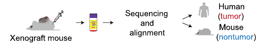
- 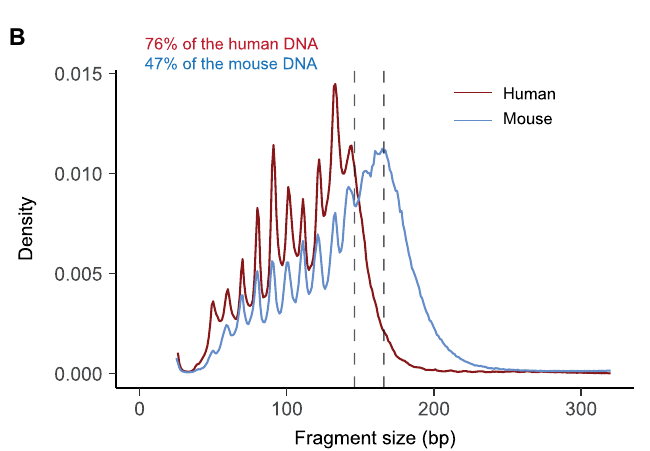

- Possible alignment strategies
  - Direct to human
  - Combined reference
  - Disambiguate [cite:@ahdesmaki2017] - Align independently to each species and assign each read pair to the species with fewer true mismatches.

** Data
- bleed dates =/= tumro volumne dates!!
- [2026-05-11 Mon] Globus transferred from /rawdata/ccrtegs44/Project_JohnShern_CS041084_14EMseqlib_042826 to aclm350:/aclm350-zpool1/
- [2026-05-12 Tue] gsutil_rsync from aclm350:/aclm350-zpool1/Project_JohnShern_CS041084_14EMseqlib_042826 to gs://chaudhuri-lab-bucket1/jeszyman/data/Flowcell_235NHYLT3/
- [ ] ingest https://mail.google.com/mail/u/0/#inbox/FMfcgzQgKvKNWDpjskqzJTvLfWKwTpDx
- NCI to Mayo transfers
  - Globus personal must be active on aclm350
  - Check free storage on aclm350, from cyberark, create a cyberark reverse tunnel
  - Initiate transfer in globus web interface on Mayo macbook
  - Upon transfer completion, gsutil rsync data to Chaudhuri lab bucket

*** Data model
**** Datapackage header
Frictionless datapackage wrapper. The six sheet-schema blocks below tangle concatenated into =data/metadata_schema.yaml= after this header, forming a complete datapackage validated via =frictionless validate data/metadata_schema.yaml --type package=.
#+begin_src yaml :tangle data/metadata_schema.yaml :mkdirp yes
# Frictionless datapackage for nf1-mouse metadata.xlsx
# Tangled from nf1-mouse.org. Do not edit directly.

name: nf1-mouse-metadata
title: NF1 Mouse K08 Aim 2 Metadata
description: Relational metadata for PDX cfDNA monitoring study (6 sheets in data/metadata.xlsx)

resources:
#+end_src
**** Mice schema
#+begin_src yaml :tangle data/metadata_schema.yaml
# Mice
# Mice table contains mouse-specific metadata for research subjects
  # Primary key also serves as foreign key to subjects table
  # Includes strain, genotype, and housing information
  - name: mice
    title: Mouse Research Subjects
    description: Mouse subjects used in research
    path: metadata.xlsx
    dialect:
      excel:
        sheet: mice
    schema:
      missingValues: &mv ["", "unknown", "UNK", "unk", "n/a", "NA", "GET", "None"]
      fields:
        # PRIMARY KEY - also serves as foreign key to subjects table
        # Three-letter prefix: 'mou' + 4 digits
        - name: mouse_id
          title: Mouse Identifier
          description: Unique identifier for mouse subject. Format is 'mou' followed by 4 digits. Links directly to subject_id in subjects table.
          example: mou0001
          type: string
          constraints:
            required: true
            unique: true
            pattern: '^mou\d{4}$'

        # MOUSE-SPECIFIC FIELDS

        - name: strain
          title: Mouse Strain
          description: Genetic background strain of the mouse
          example: nod
          type: string
          constraints:
            required: true
            maxLength: 50

        - name: stock
          title: Mouse Stock
          description: Full stock designation including genetic modifications, lowercase with underscores
          example: nod_cg_rag1_null_il2rg_null
          type: string
          constraints:
            required: true
            maxLength: 100

        - name: sex
          title: Mouse Sex
          description: Biological sex of the mouse
          example: m
          type: string
          constraints:
            required: true
            enum: [m, f]
          enumDescriptions:
            m: Male
            f: Female

        - name: birth_date
          title: Birth Date
          description: Date of birth in ISO8601 format (YYYY-MM-DD)
          example: 2024-01-15
          type: date
          constraints:
            required: false
            minimum: "2020-01-01"
            maximum: "2026-12-31"

        - name: institution_housed
          title: Institution Housed
          description: The institution where the mouse was housed for experiments
          example: washu
          type: string
          constraints:
            enum: [washu, nci]
          enumDescriptions:
            washu: Washington University in St. Louis
            nci: National Cancer Institute

        - name: study_protocol_id
          title: Study Protocol
          description: Identifier for institution research protocol
          example: 99-CC-0168
          type: string
          constraints:
            required: false

        - name: pdx_line_id
          title: PDX Line
          description: Foreign key to pdx_lines table
          type: string
          constraints:
            required: false

        - name: alt_subj
          title: Alternate Subject ID
          description: Lab-assigned mouse identifier from source institution
          example: WU487 2-1
          type: string
          constraints:
            required: false

        # OPTIONAL NOTES
        - name: notes
          title: Notes
          description: Free-text notes about this mouse
          type: string
          constraints:
            required: false
            maxLength: 500

        - name: treatment
          title: Treatment Arm
          description: Drug treatment assignment for this mouse
          type: string
          constraints:
            required: false
            enum: [vehicle, mirdametinib, volasertib, mirdametinib_volasertib, untreated]

        - name: tumor_injection_date
          title: Tumor Injection Date
          description: Date of tumor implantation
          type: date
          constraints:
            required: false

        - name: tumor_injection_site
          title: Tumor Injection Site
          description: Anatomical site of PDX tumor implantation
          type: string
          constraints:
            required: false
            enum: [flank, sciatic_nerve, intramuscular, subcutaneous, other]

        - name: treatment_start_date
          title: Treatment Start Date
          description: Date of first treatment dose. Anchor for samples.timepoint_day. Required to compute "days post treatment start" used in serial bleed designations.
          type: date
          constraints:
            required: false

        - name: treatment_end_date
          title: Treatment End Date
          description: Date treatment was terminated. Anchors the second timepoint for designs with a defined treatment-termination bleed (e.g., MN2 double-therapy cohort).
          type: date
          constraints:
            required: false

    primaryKey: mouse_id
    foreignKeys:
      - fields: pdx_line_id
        reference:
          resource: pdx_lines
          fields: pdx_line_id
#+end_src

**** PDX lines schema
#+begin_src yaml :tangle data/metadata_schema.yaml
  - name: pdx_lines
    title: PDX Lines
    description: Patient-derived xenograft lines used in the study
    path: metadata.xlsx
    dialect:
      excel:
        sheet: pdx_lines
    schema:
      missingValues: *mv
      fields:
        - name: pdx_line_id
          title: PDX Line Identifier
          description: Unique identifier for PDX line
          example: JH-2-002
          type: string
          constraints:
            required: true
            unique: true

        - name: source_tumor
          title: Source Tumor
          description: Original patient tumor identifier
          type: string
          constraints:
            required: false

        - name: chr8q_status
          title: Chromosome 8q Status
          description: Chr8q copy number status
          type: string
          constraints:
            required: false
            enum: [gain, wt]

        - name: institution
          title: Source Institution
          description: Institution providing the PDX line
          type: string
          constraints:
            required: true
            enum: [washu, jhu]

        - name: donor_sex
          title: PDX Donor Sex
          description: Biological sex of the patient from whom the PDX line was derived. Enables Y-chromosome-based tumor fraction cross-check in female host mice.
          type: string
          constraints:
            required: false
            enum: [m, f]

        - name: notes
          title: Notes
          description: Free-text notes about this PDX line
          type: string
          constraints:
            required: false
            maxLength: 500

    primaryKey: pdx_line_id
#+end_src

**** Samples schema
#+begin_src yaml :tangle data/metadata_schema.yaml
  - name: samples
    title: Blood Samples
    description: Blood samples collected from mice
    path: metadata.xlsx
    dialect:
      excel:
        sheet: samples
    schema:
      missingValues: *mv
      fields:
        - name: sample_id
          title: Sample Identifier
          description: Unique identifier for blood sample
          example: smp0001
          type: string
          constraints:
            required: true
            unique: true
            pattern: '^smp\d{4}$'

        - name: mouse_id
          title: Mouse Identifier
          description: Foreign key to mice table
          type: string
          constraints:
            required: true

        - name: bleed_type
          title: Bleed Type
          description: Type of blood collection
          type: string
          constraints:
            required: true
            enum: [serial, terminal]

        - name: timepoint_day
          title: Timepoint Day
          description: Day of collection relative to treatment start
          type: integer
          constraints:
            required: false

        - name: collection_date
          title: Collection Date
          description: Date of blood collection in ISO8601 format
          example: 2024-08-20
          type: date
          constraints:
            required: false

        - name: volume_ul
          title: Volume (uL)
          description: Collected blood volume in microliters
          type: number
          constraints:
            required: false

        - name: visual_hemolysis
          title: Visual Hemolysis
          description: Whether sample shows visible hemolysis
          type: boolean
          constraints:
            required: false

        - name: alt_spec_id
          title: Alternate Specimen ID
          description: Lab-assigned specimen identifier from source institution
          type: string
          constraints:
            required: false

        - name: notes
          title: Notes
          description: Free-text notes about this sample
          type: string
          constraints:
            required: false
            maxLength: 500

    primaryKey: sample_id
    foreignKeys:
      - fields: mouse_id
        reference:
          resource: mice
          fields: mouse_id
#+end_src

**** cfDNA isolations schema
#+begin_src yaml :tangle data/metadata_schema.yaml
  - name: cfdna_isolations
    title: cfDNA Isolations
    description: Cell-free DNA isolation records
    path: metadata.xlsx
    dialect:
      excel:
        sheet: cfdna_isolations
    schema:
      missingValues: *mv
      fields:
        - name: cfdna_iso_id
          title: cfDNA Isolation Identifier
          description: Unique identifier for cfDNA isolation
          example: iso0001
          type: string
          constraints:
            required: true
            unique: true
            pattern: '^iso\d{4}$'

        - name: sample_id
          title: Sample Identifier
          description: Foreign key to samples table
          type: string
          constraints:
            required: true

        - name: kit
          title: Isolation Kit
          description: Kit used for cfDNA isolation
          type: string
          constraints:
            required: true

        - name: spri_cleanup
          title: SPRI Bead Cleanup
          description: Whether right-sided SPRI bead selection was performed
          type: boolean
          constraints:
            required: false

        - name: input_ul
          title: Input Volume (uL)
          description: Plasma input volume in microliters
          type: number
          constraints:
            required: true

        - name: elution_ul
          title: Elution Volume (uL)
          description: Elution volume in microliters
          type: number
          constraints:
            required: false

        - name: qubit_conc_pg_ul
          title: Qubit Concentration (pg/uL)
          description: cfDNA concentration measured by Qubit HS dsDNA assay
          type: number
          constraints:
            required: false

        - name: bioanalyzer_conc_pg_ul
          title: Bioanalyzer Concentration (pg/uL)
          description: Total cfDNA concentration from Agilent Bioanalyzer HS DNA assay (full electropherogram area)
          type: number
          constraints:
            required: false
            minimum: 0

        - name: bioanalyzer_167bp_peak_pg_ul
          title: Bioanalyzer 167 bp Peak Concentration (pg/uL)
          description: cfDNA concentration within the 167 bp mono-nucleosomal peak region only (area under the electropherogram curve gated around that peak). QC criterion for EM-seq library suitability — presence of a discernible 167 bp peak is gated alongside total cfDNA >= 0.1 ng input minimum.
          type: number
          constraints:
            required: false
            minimum: 0

        - name: shipment_batch
          title: Shipment Batch
          description: Identifier for the shipment cohort in which this isolation was sent for downstream library preparation. Format YYYY-MM-DD_DESTINATION (e.g., 2026-03-30_NCI).
          type: string
          constraints:
            required: false

        - name: shipment_position
          title: Shipment Position
          description: Position label within the shipment box (corresponds to the position labels on the shipment manifest).
          type: string
          constraints:
            required: false

    primaryKey: cfdna_iso_id
    foreignKeys:
      - fields: sample_id
        reference:
          resource: samples
          fields: sample_id
#+end_src

**** Sequencing libraries schema
#+begin_src yaml :tangle data/metadata_schema.yaml
  - name: sequencing_libraries
    title: Sequencing Libraries
    description: EM-seq library preparation and sequencing records
    path: metadata.xlsx
    dialect:
      excel:
        sheet: sequencing_libraries
    schema:
      missingValues: *mv
      fields:
        - name: library_id
          title: Library Identifier
          description: Unique identifier for sequencing library
          example: lib0001
          type: string
          constraints:
            required: true
            unique: true
            pattern: '^lib\d{4}$'

        - name: cfdna_iso_id
          title: cfDNA Isolation Identifier
          description: Foreign key to cfdna_isolations table
          type: string
          constraints:
            required: true

        - name: prep_kit
          title: Library Prep Kit
          description: Kit used for library preparation
          type: string
          constraints:
            required: true

        - name: sequencing_platform
          title: Sequencing Platform
          description: Sequencing platform used
          type: string
          constraints:
            required: false

        - name: read_length
          title: Read Length
          description: Sequencing read length in base pairs
          type: integer
          constraints:
            required: false

        - name: lib_conc_ng_ul
          title: Library Concentration (ng/uL)
          description: Post-prep library concentration
          type: number
          constraints:
            required: false

    primaryKey: library_id
    foreignKeys:
      - fields: cfdna_iso_id
        reference:
          resource: cfdna_isolations
          fields: cfdna_iso_id
#+end_src

**** Tumor measurements schema
#+begin_src yaml :tangle data/metadata_schema.yaml
  - name: tumor_measurements
    title: Tumor Measurements
    description: Longitudinal tumor volume and body weight measurements
    path: metadata.xlsx
    dialect:
      excel:
        sheet: tumor_measurements
    schema:
      missingValues: *mv
      fields:
        - name: mouse_id
          title: Mouse ID
          description: Foreign key to mice table
          type: string
          constraints:
            required: true

        - name: measurement_date
          title: Measurement Date
          description: Date of measurement in ISO8601 format
          type: date
          constraints:
            required: true

        - name: days_post_implant
          title: Days Post Implantation
          description: Number of days after tumor implantation
          type: integer
          constraints:
            required: false
            minimum: 0

        - name: tumor_volume_mm3
          title: Tumor Volume (mm3)
          description: Tumor volume in cubic millimeters
          type: number
          constraints:
            required: false
            minimum: 0

        - name: body_weight_g
          title: Body Weight (g)
          description: Mouse body weight in grams
          type: number
          constraints:
            required: false
            minimum: 0

    foreignKeys:
      - fields: mouse_id
        reference:
          resource: mice
          fields: mouse_id
#+end_src

**** TODO Resolve PDX donor sex for JH-2-002, JH-2-055, MN2
Three PDX lines in =pdx_lines= lack donor sex annotation. WashU lines (WU-225, WU-356, WU-487) resolved as male via the Sarcoma Banking Subjects List (WUSM) on 2026-04-15. Remaining:
- =JH-2-002= — participant records (par0307/par0308) exist in mpnst metadata but sex is =None=; no match in WashU banking list
- =JH-2-055= — participant records (par0003 jhh, par0328 nci) exist but sex is =UNK=/=None=; no match in WashU banking list
- =MN2= — no participant record found in mpnst metadata, manual_inputs, or WashU banking list (origin Mayo per name convention but institution column shows =washu=)

Ask Hirbe lab / Pratilas lab for donor sex on these three lines. Needed for Y-chromosome tumor-fraction cross-check (all 140 host mice are female).

*** cfDNA isolation
cfDNA is isolated from mouse plasma using the MagMAX Cell-Free DNA Isolation Kit (Thermo Fisher, MAN0015629) following the manual protocol option 2 for small volumes. For 50 μL samples, plasma is diluted to 100 μL with PBS before isolation.

Right-sided SPRI bead selection (AMPure XP, 1:1 bead:sample ratio followed by 7:1 capture) is applied to remove contaminating genomic DNA when hemolysis is suspected.
*** cfDNA isolation optimization experiment                                     :sci-exp:
**** Data tables
#+name: pdx
| pdx_id | pdx_alt_id |
|--------+------------|
| pdx001 | WU-255     |
| pdx002 | 2-055      |

#+name: mice
| mouse_id | pdx    |
|----------+--------|
| ms001    | pdx001 |
| ms002    | pdx001 |
| ms003    | NA     |
| ms004    | NA     |
| ms005    | pdx002 |
| ms006    | pdx002 |
|          |        |

#+name: samples
| sample_id | mouse_id | bleed_type | blood?_mL |
|-----------+----------+------------+-----------|
| bd001     | ms001    | terminal   | ~200      |
| bd002     | ms002    | terminal   | ~200      |
| bd003     | ms003    | terminal   | ~200      |
| bd004     | ms004    | terminal   | ~200      |
| bd005     | ms005    | serial     | ~50       |
| bd006     | ms006    | serial     | ~50       |

#+name: plasma-ders
| mouse_id | sample_id | pder_id | pder_type | v_heme |
|----------+-----------+---------+-----------+--------|
| ms001    | bd001     | pder001 | plasma    | no     |
| ms002    | bd002     | pder002 | plasma    | no     |
| ms003    | bd003     | pder003 | plasma    | no     |
| ms004    | bd004     | pder004 | plasma    | yes    |
| ms005    | bd005     | pder005 | plasma    | ?      |
| ms006    |           |         | plasma    |        |

#+name: pooled-plasma
| pooled_pder_id | source_pder_id |
|----------------+----------------|
| pool001        | pder001        |
| pool001        | pder002        |

#+name: cfdna-isolations
| pder_id | cf_iso_id | spri | input_ul |
|---------+-----------+------+----------|
| pder002 | cfiso012  | no   |       50 |
| pder003 | cfiso003  | yes  |       50 |
| pder003 | cfiso006  | yes  |      200 |
| pder003 | cfiso008  | no   |       50 |
| pder003 | cfiso009  | no   |      200 |
| pder004 | cfiso004  | yes  |       50 |
| pder004 | cfiso005  | yes  |      200 |
| pder004 | cfiso013  | no   |      200 |
| pder004 | cfiso007  | no   |       50 |
| pder005 | cfiso011  | no   |       50 |
| pder005 | cfiso014  | yes  |       50 |
| pool001 | cfiso015  | no   |       50 |
| pool002 | cfiso016  | no   |      200 |

- Mouse plasma sample bank [2024-11-01 Fri] [[https://wustl.box.com/s/jdkh9q3cdh80abyk6983y2adc0gccn25][box]]
- data model
  - entities
    - mouse
      - mouse-id
      - weight -day
    - tumor
      - omics profile
	- chr8
	- suz12
	- eed
	- tp53
	- cdkn2a
	- ckdn2b
	- nf1
    - pdx
      - pdx-id
      - tumor-source
      - volume / day
      - treatment
	- drug (HDAC, MEKi)
    - sample
      - tissue
      - plasma
	- volume
	- collect date
	- terminal / nonterminal
	- visual-hemolyzed
    - dna-isolate
      - qubit-dna-conc
      - nanodrop
	- dna-conc
	- 260-280-ratio
	- 260-230-ratio
	- maybe oxyhemoglobin score, but only human i think 414nm, has been done in dog- https://bmcvetres.biomedcentral.com/articles/10.1186/s12917-022-03445-8#Abs1
	- spectrum file
      - bioanalyzer
	- trace-file
	- percent-cfdna-target
	- main-peak-height
	- cfdna-area-ratio
- [2025-02-21 Fri] Taylor "Okay, we dont have the same PDX. We use Shim10, Shim18, ISLE (an NIH one), JH2002, PP4T"
- [2025-02-21 Fri] Sequencing pilot design meeting. Taylor to confirm sample numbers and depth with Jack. Jeff picks WashU samples. Mark to investigate qPCR for human/mouse-specific LINE-based cfDNA quantification.
- https://mail.google.com/mail/u/0/#inbox/FMfcgzQZTMHNTlZZDvQgSmjqTmxHSMpm
**** R analysis code
#+name: qubit-index
| qubit_file                  | qubit_id                                        | pder_id  |
|-----------------------------+-------------------------------------------------+----------|
| Qubit_12_5_24.csv           | Mouse 1 + 2 PDX 1 50uL - 2                      | cfiso015 |
| Qubit_12_5_24.csv           | Mouse 1 + 2 PDX 1 50uL - 1                      | cfiso015 |
| Qubit_12_5_24.csv           | Mouse 1 + 2 PDX 1 200uL - 2                     | cfiso016 |
| Qubit_12_5_24.csv           | Mouse 1 + 2 PDX 1 200uL - 1                     | cfiso016 |
| 12_3_24_Qubit - labeled.csv | SPRI - Mouse 4 No PDX Terminal w/ Hemo - 50uL   | cfiso004 |
| 12_3_24_Qubit - labeled.csv | SPRI - Mouse 3 No PDX Terminal w/o Hemo - 50uL  | cfiso003 |
| 12_3_24_Qubit - labeled.csv | SPRI - Mouse 4 No PDX Terminal w/ Hemo - 200uL  | cfiso005 |
| 12_3_24_Qubit - labeled.csv | SPRI - Mouse 3 No PDX Terminal w/o Hemo - 50uL  | cfiso003 |
| 12_3_24_Qubit - labeled.csv | Mouse 4 No PDX Terminal w/ Hemo - 50uL          | cfiso007 |
| 12_3_24_Qubit - labeled.csv | Mouse 3 No PDX Terminal w/o Hemo - 50uL         | cfiso008 |
| 12_3_24_Qubit - labeled.csv | Mouse 3 No PDX Terminal w/o Hemo - 200uL        | cfiso009 |
| 12_3_24_Qubit - labeled.csv | Mouse 2 PDX 1 Serial - 50uL                     | cfiso011 |
| 12_3_24_Qubit - labeled.csv | SPRI - Mouse 4 No PDX Terminal w/ Hemo - 50uL   | cfiso004 |
| 12_3_24_Qubit - labeled.csv | SPRI - Mouse 4 No PDX Terminal w/ Hemo - 200uL  | cfiso005 |
| 12_3_24_Qubit - labeled.csv | SPRI - Mouse 3 No PDX Terminal w/o Hemo - 50uL  | cfiso003 |
| 12_3_24_Qubit - labeled.csv | SPRI - Mouse 2 PDX 1 Serial - 50uL              | cfiso014 |
| 12_3_24_Qubit - labeled.csv | Mouse 4 No PDX Terminal w/ Hemo - 50uL          | cfiso007 |
| 12_3_24_Qubit - labeled.csv | Mouse 3 No PDX Terminal w/o Hemo - 50uL         | cfiso008 |
| 12_3_24_Qubit - labeled.csv | Mouse 3 No PDX Terminal w/o Hemo - 200uL        | cfiso009 |
| 12_3_24_Qubit - labeled.csv | Mouse 2 PDX 1 Serial - 50uL                     | cfiso011 |
| 12_3_24_Qubit - labeled.csv | SPRI - Mouse 4 No PDX Terminal w/ Hemo - 50uL   | cfiso004 |
| 12_3_24_Qubit - labeled.csv | SPRI - Mouse 4 No PDX Terminal w/ Hemo - 200uL  | cfiso005 |
| 12_3_24_Qubit - labeled.csv | SPRI - Mouse 3 No PDX Terminal w/o Hemo - 50uL  | cfiso003 |
| 12_3_24_Qubit - labeled.csv | SPRI - Mouse 3 No PDX Terminal w/o Hemo - 200uL | cfiso006 |
| 12_3_24_Qubit - labeled.csv | SPRI - Mouse 2 PDX 1 Serial - 50uL              | cfiso014 |
| 12_3_24_Qubit - labeled.csv | Mouse 4 No PDX Terminal w/ Hemo - 50uL          | cfiso007 |
| 12_3_24_Qubit - labeled.csv | Mouse 4 No PDX Terminal w/ Hemo - 200uL         | cfiso013 |
| 12_3_24_Qubit - labeled.csv | Mouse 3 No PDX Terminal w/o Hemo - 50uL         | cfiso008 |
| 12_3_24_Qubit - labeled.csv | Mouse 3 No PDX Terminal w/o Hemo - 200uL        | cfiso009 |
| 12_3_24_Qubit - labeled.csv | Mouse 2 PDX 1 Serial - 50uL                     | cfiso011 |

See [[file:nf1-mouse.org::*Bioanalyzer QC analysis][Bioanalyzer QC analysis]] in Methods for bioanalyzR analysis code.

#+begin_src R :session nf1-mouse :var cfdna_isolations=cfdna-isolations
cfdna_isolations

#+end_src

#+begin_src R :session nf1-mouse :var cfdna_isolations=cfdna-isolations :var qubit_index=qubit-index :var pdx=pdx :var mice=mice :var samples=samples :var plasma_ders=plasma-ders
install.packages("tidyverse")

library(tidyverse)

qubit_input1 = read_csv("./data/12_3_24_Qubit - labeled.csv", skip = 1)

qubit_input2 = read_csv("./data/Qubit_12_5_24.csv")

qubit_input = merge(qubit_input1,qubit_input2, all = T)

qubit_mod <- qubit_input %>%
  inner_join(qubit_index, by = c("Run ID" = "qubit_id")) %>%
  as_tibble() %>%
  mutate(input_ul = `Sample Volume (uL)`,
         qubit_pg_ul = `Qubit tube conc.`) %>%
  mutate(qubit_pg_ul = as.numeric(qubit_pg_ul)) %>%
  mutate(input_pg = input_ul * qubit_pg_ul) %>%
  mutate(input_pg_present = ifelse(is.na(input_pg), "no", "yes")) %>%
  group_by(pder_id) %>%
  mutate(
    # Identify the maximum input_ul for each pder_id
    max_input_ul = max(input_ul, na.rm = TRUE),
    # Determine the input_pg corresponding to the row with the max input_ul
    max_input_pg = input_pg[input_ul == max_input_ul][1],
    # Calculate the expected input_pg using the formula
    input_pg_expected = (input_ul / max_input_ul) * max_input_pg
  ) %>%
  ungroup() %>%
  mutate(input_pg_ul = input_pg / input_ul)

names(qubit_mod)

qubit = qubit_mod

ggplot(test, aes(x = pder_id, y = input_pg_expected)) + geom_boxplot() + geom_point()

qubit %>%
  mutate(qubit_pg_ul = ifelse(is.na(qubit_pg_ul), 0, qubit_pg_ul)) %>%
  mutate(input_ul = factor(input_ul)) %>%
  ggplot(., aes(x = pder_id, y = qubit_pg_ul)) +
  geom_jitter(aes(color = input_pg_present, shape = input_ul), size = 4) +  # Color points based on value_type
  geom_hline(yintercept = .5) +
  theme_minimal()

qubit %>%
  ggplot(., aes(x = pder_id, y = input_pg_ul)) +
  geom_boxplot()

  # Group by pder_id
  group_by(pder_id) %>%
  # Find the row with the maximum input_ul for each pder_id
  mutate(input_pg_expected = input_ul/max(input_ul) * max(input_pg))

           input_pg[input_ul == max(input_ul, na.rm = TRUE)]) %>%
  # Ungroup to remove the grouped structure
  ungroup()

  group_by(pder_id) %>%
  mutate()

names(qubit)

qubit %>% inner_join(qubit_index, by)

class(cfdna_isolations)
qubit_index
pdx
mice
samples
plasm_ders
#+end_src
**** TODO Mouse cfDNA Isolation Optimization Protocol
:PROPERTIES:
:ID:       881009ca-8675-48c2-a320-edf263e9b8f8
:export_options: toc:nil tags:nil todo:nil \n:t ^:nil H:15 d:nil
:export_file_name: ./protocols/nf1-mouse-cfdna-isolation-optimization-protocol.pdf
:export_author: Jeffrey Szymanski
:export_latex_class: empty
:export_latex_header+: \usepackage{/home/jeszyman/repos/latex/sty/documentation}
:export_latex_header+: \usepackage[backend=bibtex,style=numeric,url=true]{biblatex}
:export_latex_header+: \addbibresource{../resources/nf1-mouse.bib}
:END:
:DRAWER:
- [[elisp:(run-latex-at-point)][compile]] using [[id:3975a173-ac71-4c02-b032-ef215329ca59][run-latex-at-point]]
- [[file:protocols/nf1-mouse-cfdna-isolation-optimization-protocol.pdf][PDF]]
- [[file:protocols/nf1-mouse-cfdna-isolation-optimization-protocol.tex][TeX]]
:END:
#+begin_src emacs-lisp
(setq org-latex-prefer-user-labels t)
#+end_src
#+begin_src bash
cd ~/repos/nf1-mouse/protocols
lualatex -interaction=nonstopmode nf1-mouse-cfdna-isolation-optimization-protocol.tex
biber nf1-mouse-cfdna-isolation-optimization-protocol
lualatex -interaction=nonstopmode nf1-mouse-cfdna-isolation-optimization-protocol.tex
lualatex -interaction=nonstopmode nf1-mouse-cfdna-isolation-optimization-protocol.tex
#+end_src

***** Preamble                                                       :ignore:

#+include: "../latex/latex.org::#dd9bb77e-6ff7-44e0-9026-c371bdaf9603" :only-contents t
#+latex: % [[file:~/repos/latex/latex.org::#dd9bb77e-6ff7-44e0-9026-c371bdaf9603][Last compiled]]

\vspace{5mm}
\hfill Version 2

***** Introduction
Experiment to test and optimize cell-free DNA isolation conditions for small volumes of mouse plasma.

We will use this experiment to ask about isolation precision (repeatability and reproducibility), effects of hemolysis and SPRI bead removal of genomic DNA, and the ability to detect PDX ctDNA.

The experiment workflow is summarized in Figure [[fig_workflow]].

#+BEGIN_SRC mermaid :file ./resources/media/workflow.pdf :pdf-fit :quiet :tangle /tmp/test.mmd :comments no :eval always-export

   flowchart LR

   %% Classes with Larger Text

   classDef input_pdx1 fill:#8DA8FF,stroke:#333,stroke-width:4px,text-align:left,font-size:22px;
   classDef input_pdx1_vheme fill:#E74C3C,stroke:#333,stroke-width:4px,text-align:left,font-size:22px;
   classDef input_nopdx fill:#3498DB,stroke:#333,stroke-width:4px,text-align:left,font-size:22px;
   classDef input_nopdx_vheme fill:#E74C3C,stroke:#333,stroke-width:4px,text-align:left,font-size:22px;

   classDef pdx1 fill:#8DA8FF,stroke:#333,stroke-width:4px,font-size:22px;
   classDef pdx1_vheme fill:#E74C3C,stroke:#333,stroke-width:4px,font-size:22px;
   classDef nopdx fill:#3498DB,stroke:#333,stroke-width:4px,font-size:22px;
   classDef nopdx_vheme fill:#E74C3C,stroke:#333,stroke-width:4px,font-size:22px;

   classDef dum fill-opacity:0,stroke-width:0,stroke:none,height:0px,width:0px,font-size:22px;

   classDef analysis stroke:#333,stroke-width:4px,text-align:left,font-size:22px;

   %% Nodes

   %% Inputs
   ms1_pdx1_term[
   Mouse 1
   PDX1 1
   Terminal bleed
   ~300 μL]:::input_pdx1

   ms2_pdx1_term[
   Mouse 2
   PDX1 1
   Terminal bleed
   ~300 μL]:::input_pdx1

   ms5_pdx1_serialf([
   Mouse 5
   PDX1 1
   Final serial bleed
   ~50 μL]):::input_pdx1

   ms6_pdx1_serial_vheme([
   Mouse 6
   PDX1 1
   Serial bleed
   ~50 μL]):::input_pdx1_vheme

   ms3_nopdx_term[
   Mouse 3
   No PDX1
   Terminal bleed
   ~300 μL]:::input_nopdx

   ms4_nopdx_term_vheme[
   Mouse 4
   No PDX1
   Terminal bleed
   VISUAL HEMOLYSIS
   ~300 μL]:::input_nopdx_vheme

   %% Pooled

   pdx1_term_pool[
   Pooled Mice 1 & 2
   PDX1 1
   ~600 μL]:::pdx1

   %% Aliquots

   pdx1_term_pool_alq_big1{{
   200 μL aliquot}}:::pdx1

   pdx1_term_pool_alq_big2{{
   200 μL aliquot}}:::pdx1

   pdx1_term_pool_alq_small1{{
   50 μL Aliquot}}:::pdx1

   pdx1_term_pool_alq_small2{{
   50 μL Aliquot}}:::pdx1

   ms3_nopdx_term_big{{
   200 μL Aliquot}}:::nopdx

   ms3_nopdx_term_small{{
   50 μL Aliquot}}:::nopdx

   ms4_nopdx_term_big{{
   200 μL Aliquot}}:::nopdx_vheme

   ms4_nopdx_term_small{{
   50 μL Aliquot}}:::nopdx_vheme

   %% Isolations
   ms5_pdx1_serialf_iso[[MagMax Isolation]]:::pdx1

   ms6_pdx1_serial_vheme_iso[[MagMax Isolation]]:::pdx1_vheme

   pdx1_term_pool_alq_big2_iso[[MagMax isolation]]:::pdx1

   pdx1_term_pool_alq_big1_iso[[MagMax isolation]]:::pdx1

   pdx1_term_pool_alq_small1_iso[[MagMax isolation]]:::pdx1

   pdx1_term_pool_alq_small2_iso[[MagMax isolation]]:::pdx1

   ms3_nopdx_term_big_iso[[
   MagMax isolation]]:::nopdx

   ms3_nopdx_term_small_iso[[
   MagMax isolation]]:::nopdx

   ms4_nopdx_term_big_iso[[
   MagMax isolation]]:::nopdx_vheme

   ms4_nopdx_term_small_iso[[
   MagMax isolation]]:::nopdx_vheme

   %% Bead
   ms6_pdx1_serial_vheme_iso_rtbead[/
   Right-side bead selection/]:::pdx1_vheme

   ms3_nopdx_term_big_iso_rtbead[/
   Right-sided bead selection
   /]:::nopdx_vheme

   ms3_nopdx_term_small_iso_rtbead[/
   Right-sided bead selection
   /]:::nopdx_vheme

   ms4_nopdx_term_big_iso_rtbead[/
   Right-sided bead selection
   /]:::nopdx_vheme

   ms4_nopdx_term_small_iso_rtbead[/
   Right-sided bead selection
   /]:::nopdx_vheme

   Analysis((Analysis)):::analysis
   %% Edges

   ms1_pdx1_term  ==> pdx1_term_pool
   ms2_pdx1_term  ==> pdx1_term_pool

   pdx1_term_pool ==> pdx1_term_pool_alq_big1 ==> pdx1_term_pool_alq_big1_iso ==> pdx1_term_pool_alq_big1_iso_nobead[ ]:::dum  ==>|**pdx1_pool_ms12_bigaq1**| Analysis

   pdx1_term_pool ==> pdx1_term_pool_alq_big2 ==> pdx1_term_pool_alq_big2_iso ==> pdx1_term_pool_alq_big2_iso_nobead[ ]:::dum  ==>|**pdx1_pool_ms12_bigaq2**| Analysis

   pdx1_term_pool ==> pdx1_term_pool_alq_small1 ==> pdx1_term_pool_alq_small1_iso ==> pdx1_term_pool_alq_small1_iso_nobead[ ]:::dum ==>|**pdx1_pool_ms12_smallaq1**| Analysis

   pdx1_term_pool ==> pdx1_term_pool_alq_small2 ==> pdx1_term_pool_alq_small2_iso ==> pdx1_term_pool_alq_small2_iso_nobead[ ]:::dum ==>|**pdx1_pool_ms12_smallaq2**| Analysis

   ms5_pdx1_serialf ==> ms5_pdx1_serialf_nopool[ ]:::dum ==> ms5_pdx1_serialf_noaliq[ ]:::dum ==> ms5_pdx1_serialf_iso ==> ms5_pdx1_serialf_iso_nobead[ ]:::dum ==> |**ms5_pdx1_serialf**| Analysis

   ms6_pdx1_serial_vheme ==> ms6_pdx1_serial_vheme_nopool[ ]:::dum ==> ms6_pdx1_serial_vheme_noaliq[ ]:::dum ==> ms6_pdx1_serial_vheme_iso ==> ms6_pdx1_serial_vheme_iso_rtbead ==> |**ms6_vheme_pdx1_serial_rtbead**| Analysis

   ms3_nopdx_term ==> ms3_nopdx_term_nopool[ ]:::dum ==> ms3_nopdx_term_big ==> ms3_nopdx_term_big_iso ==> ms3_nopdx_term_big_iso_nobead[ ]:::dum ==>|**ms3_nopdx_term_bigaq**| Analysis

   ms4_nopdx_term_vheme ==> ms4_nopdx_term_nopool[ ]:::dum ==> ms4_nopdx_term_big ==> ms4_nopdx_term_big_iso ==> ms4_nopdx_term_big_iso_nobead[ ]:::dum ==>|**ms4_nopdx_term_vheme_bigaq**| Analysis

                      ms3_nopdx_term_nopool[ ]:::dum ==> ms3_nopdx_term_small ==> ms3_nopdx_term_small_iso ==> ms3_nopdx_term_small_iso_nobead[ ]:::dum ==> |**ms3_nopdx_term_smallaq**|Analysis

                      ms4_nopdx_term_nopool[ ]:::dum ==> ms4_nopdx_term_small ==> ms4_nopdx_term_small_iso ==> ms4_nopdx_term_small_iso_nobead[ ]:::dum ==> |**ms4_nopdx_term_vheme_smallaq**|Analysis

   ms3_nopdx_term_big_iso ==> ms3_nopdx_term_big_iso_rtbead ==> |**ms3_nopdx_term_bigaq_rtbead**| Analysis
   ms3_nopdx_term_small_iso ==> ms3_nopdx_term_small_iso_rtbead ==> |**ms3_nopdx_term_smallaq_rtbead**| Analysis

   ms4_nopdx_term_big_iso ==> ms4_nopdx_term_big_iso_rtbead ==> |**ms4_nopdx_term_vheme_bigaq_rtbead**| Analysis
   ms4_nopdx_term_small_iso ==> ms4_nopdx_term_small_iso_rtbead ==> |**ms4_nopdx_term_vheme_smallaq_rtbead**| Analysis

#+END_SRC

#+CAPTION: Experiment Workflow. Workflow is divided into stages from left to right of input, pooling, aliquoting, isolation, right-sided bead selection, and analysis. Final isolations to be analyzed are labeled to the right.
#+NAME: fig_workflow
#+ATTR_LATEX: :placement [H]
[[file:../resources/media/workflow.pdf]]

Inputs necessary for the protocol are described in Table [[tab_inputs]]]. All inputs should be from untreated mice. Note ms1 and ms2 share PDX1 (WU-255) so their terminal plasma can be pooled; ms5 and ms6 share PDX2 (JH-2-055) for the serial-bleed arm (per Version 2 of the protocol). Ideally, all PDX mice should have large tumors at each time point sampled.

#+NAME: tab_inputs
#+CAPTION: Isolation workflow inputs.
#+ATTR_LATEX: :align l p{0.7\textwidth} :booktabs t
| Input Identifier      | Description                                             |
|-----------------------+---------------------------------------------------------|
| ms1_pdx1_term         | Mouse 1, PDX1, terminal bleed, no visual hemolysis      |
| ms2_pdx1_term         | Mouse 2. PDX1, terminal bleed, no visual hemolysis      |
| ms3_nopdx_term        | Mouse 3, no PDX, terminal bleed, no visual hemolysis    |
| ms4_nopdx_term_vheme  | Mouse 4, no PDX, terminal bleed, _with_ visual hemolysis  |
| ms5_pdx1_serialf      | Mouse 5, PDX1, final serial sample, no visual hemolysis |
| ms6_pdx1_serial_vheme | Mouse 6, PDX1, serial bleed _with_ visual hemolysis       |

Final isolations to be analyzed are shown in Table [[tab_analytes]]. For each final isolation, the same analyses will be performed, generating the same output variables. Specific experimental questions addressed are in Table [[tab_questions]].

#+NAME: tab_analytes
#+CAPTION: Final isolated analytes to be analyzed.
#+ATTR_LATEX: :align l p{0.7\textwidth} :booktabs t
| Isolation Identifier                | Description                                                                                               |
|-------------------------------------+-----------------------------------------------------------------------------------------------------------|
|                                     | <30>                                                                                                      |
| ms3_nopdx_term_bigaq                | Mouse 3, no PDX, terminal bleed, large volume isolation                                                   |
| ms3_nopdx_term_bigaq_rtbead         | Mouse 3, no PDX, terminal bleed, large volume isolation, right-side bead selection                        |
| ms3_nopdx_term_smallaq              | Mouse 3, no PDX, terminal bleed, small volume isolation                                                   |
| ms3_nopdx_term_smallaq_rtbead       | Mouse 3, no PDX, terminal bleed, small volume isolation, right-side bead selection                        |
| ms4_nopdx_term_vheme_bigaq          | Mouse 4, no PDX, terminal bleed, with visual hemolysis, large volume isolation                            |
| ms4_nopdx_term_vheme_bigaq_rtbead   | Mouse 4, no PDX, terminal bleed, with visual hemolysis, large volume isolation, right-side bead selection |
| ms4_nopdx_term_vheme_smallaq        | Mouse 4, no PDX, terminal bleed, with visual hemolysis, small isolation                                   |
| ms4_nopdx_term_vheme_smallaq_rtbead | Mouse 4, no PDX, terminal bleed, with visual hemolysis, isolation, right-side bead selection              |
| ms5_pdx1_serialf                    | Mouse 5 with PDX, final serial sample                                                                     |
| ms6_pdx1_serial_vheme_rtbead        | Mouse 6 with PDX, serial bleed with visual hemolysis, right-side bead selection                           |
| pdx1_pool_ms12_bigaq1               | Pooled plasma from mice 1 & 2 with PDX, large volume isolation, replicate 1                               |
| pdx1_pool_ms12_bigaq2               | Pooled plasma from mice 1 & 2 with PDX, large volume isolation, replicate 2                               |
| pdx1_pool_ms12_smallaq1             | Pooled plasma from mice 1 & 2 with PDX, small volume isolation, replicate 1                               |
| pdx1_pool_ms12_smallaq2             | Pooled plasma from mice 1 & 2 with PDX, small volume isolation, replicate 2                               |

\clearpage

#+NAME: tab_questions
#+CAPTION: Relevant experimental questions and associated data.
#+ATTR_LATEX: :environment longtable :align |p{7cm}|p{6cm}|p{3cm}| :rules \hline
|------------------------------------------------------------------------+---------------------------------------------------------------------+-------------------|
| Question                                                               | Sample or comparison                                                | Outcome metrics   |
|------------------------------------------------------------------------+---------------------------------------------------------------------+-------------------|
| Are isolations repeatable?                                             | pdx1_pool_ms12_bigaq 1 vs 2                                         | All               |
|------------------------------------------------------------------------+---------------------------------------------------------------------+-------------------|
| Are isolations repeatable at low volume?                               | pdx1_pool_ms12_smallaq 1 vs 2                                       | All               |
|------------------------------------------------------------------------+---------------------------------------------------------------------+-------------------|
| Are isolations reproducible across volume?                             | pdx1_pool_ms12_bigaq1/2 vs smallaq 1/2                              | All               |
|------------------------------------------------------------------------+---------------------------------------------------------------------+-------------------|
| Are terminal and final serial bleeds similar?                          | pdx_pool_ms12_smallaq1/2 vs ms5_pdx1_serialf                        | All               |
|------------------------------------------------------------------------+---------------------------------------------------------------------+-------------------|
| Do SPRI beads affect isolation of non-hemolyzed samples?               | ms3_nopdx_term_bigaq vs ms3_nopdx_bigaq_rtbead                      | All               |
|------------------------------------------------------------------------+---------------------------------------------------------------------+-------------------|
| Do SPRI beads affect isolation of non-hemolyzed samples at low volume? | ms3_nopdx_term_smallaq vs ms3_nopdx_term_smallaq_rtbead             | All               |
|------------------------------------------------------------------------+---------------------------------------------------------------------+-------------------|
| Is hemolysis detectable by spectrophotometry?                          | ms4_nopdx_term_vheme_bigaq vs ms3_nopdx_term_bigaq                  | Hemolysis index   |
|------------------------------------------------------------------------+---------------------------------------------------------------------+-------------------|
| Is hemolysis detectable by spectrophotometry at low volume?            | ms4_nopdx_term_vheme_smallaq vs ms3_nopdx_term_smallaq              | Hemolysis index   |
|------------------------------------------------------------------------+---------------------------------------------------------------------+-------------------|
| Do SPRI beads remove genomic DNA?                                      | ms4_nopdx_term_vheme_bigaq_rtbead vs ms4_nopdx_term_vheme_bigaq     | Bioanalyzer       |
|------------------------------------------------------------------------+---------------------------------------------------------------------+-------------------|
| Do SPRI beads remove genomic DNA at low volume?                        | ms4_nopdx_term_vheme_smallaq_rtbead vs ms4_nopdx_term_vheme_smallaq | Bioanalyzer       |
|------------------------------------------------------------------------+---------------------------------------------------------------------+-------------------|
| Is PDX ctDNA evident?                                                  | pdx1_pool_ms12_bigaq1/2 vs ms3_nopdx_term_bigaq                     | conc, Bioanalyzer |
|------------------------------------------------------------------------+---------------------------------------------------------------------+-------------------|
| Is PDX ctDNA evident at low volume?                                    | pdx1_pool_ms12_smallaq1/2 vs ms3_nopdx_term_smallaq                 | conc, Bioanalyzer |
|------------------------------------------------------------------------+---------------------------------------------------------------------+-------------------|
| Is PDX ctDNA evident from serial samples?                              | ms1_pdx1_serialf vs ms3_nopdx_term_smallaq                          | conc, Bioanalyzer |
|------------------------------------------------------------------------+---------------------------------------------------------------------+-------------------|
| Is PDX ctDNA evident with corrected hemolysis?                         | ms6_pdx1_serial_vheme_rtbead vs ms4_nopdx_term_vheme_smallaq        | conc, Bioanalyzer |
|------------------------------------------------------------------------+---------------------------------------------------------------------+-------------------|

***** Protocol

1. Ensure inputs - see Table ref:tab_inputs.

2. Input pre-processing - Perform pre-processing immediately prior to the input's isolation on a per-input basis. Yield calculation will require set volumes, so use the exact volumes indicated as inputs.

   - Pool mouse 1 and mouse 2 terminal bleed plasma.
   - Aliquot pooled PDX terminal plasma (200 μL, 200 μL, 50 μL, 50 μL).
   - Aliquot mouse 3 terminal bleed plasma (200 μL, 50 μL).
   - Aliquot mouse 4 terminal bleed plasma (200 μL, 50 μL).

3. Isolate cfDNA - for each isolation, follow the steps of the \citetitle{magmax_manual} \cite{magmax_manual}. (This is the manual specifically for small volume isolations). Use manual protocol, option 2. For 50 μL samples, first dilute sample volume up to 100 μL with PBS.

4. Perform right-sided bead selection as described in \citeauthor{heider2020} \citetitle{heider2020} \cite{heider2020}, methods section "Size Selection and Library Preparation of Blood-Spot Cell-Free DNA" through the 7:1 bead ratio elution:

/We opted to perform size selection to remove contaminating long gDNA fragments that would have prohibited library preparation. Thus, a right-side size selection was performed on DNA eluates using AMPure XP beads (Beckman Coulter). For this purpose, we adapted a protocol for a right-side size selection (13). Following optimization of bead:sample ratios for cfDNA fragment sizes, we used a bead:sample ratio of 1:1 to remove contaminating gDNA. The supernatant was retained as part of the right-side size-selection protocol. A second size-selection step used a 7:1 bead:sample ratio to capture remaining fragments, and the size-selected DNA was eluted in 25 μL water./

The resulting 25 μL volume is appropriate to carry forward for EM-seq library preparation \cite{NEB2024}.

--Per-sample STOPPING POINT--

Analysis for each final isolate:
   1. Qubit High sensitivity dsDNA fluorometric quantification as described in the kit user guide \cite{qubit}. Generate one standard curve for each session (can span multiple or all samples). Perform for each analyte *in nonconsecutive duplicate*. One microliter volumes are sufficient for testing. If resulting concentration is <200 pg, re-measure with 3 μL volumes. Retain concentration values and raw flourescence values including standard curve raw fluorescence.
   2. Nanodrop spectrophotometry as described in the user guide \cite{nanodrop}. Use same volume as in the Qubit and again test all samples in nonconsecutive duplicate. Use the dsDNA measurement program and retain ng/uL, A260/A280, A260/A230, and UV spectrum. Also take a A414 reading.
   3. Bioanalyzer electrophoresis with HS kit protocol. Perfrom once per analyte. Retain peak table XML and electropherogram XML.
***** Change Log
- Version 2 - Adjusted for serial bleeds from separate mice than pooled terminal bleed PDX sources.
***** References                                                     :ignore:
#+LATEX: \printbibliography

#  LocalWords:  smallaq pdx SPRI
*** EM-seq library preparation
Libraries prepared with NEBNext Enzymatic Methyl-seq (EM-seq) kit, which preserves native fragment features. Alignment with Disambiguate to retain only human reads from xenograft samples.

- Input requirements by kit version:
  - Original EM-seq (E7120): minimum 10 ng DNA input
  - EM-seq v2 (E8015): minimum 100 pg DNA input (100-fold lower)
- Existing 18 libraries (all Chr8q-WT) were prepared from samples with ≥100 pg/uL bioanalyzer cfDNA concentration, well above either kit minimum at 25 uL elution volume.
- New round (2026-03-24): NIH (Chloe Sachs) preparing libraries. Some JH-2-055 serial samples as low as ~35 pg/uL in 167 bp peak (~890 pg total in 25 uL). Requires v2 kit; original kit minimum would not be met.
*** Sequencing and alignment
Target median deduplicated sequencing depth of 15×. Reads aligned to hg38 with BISCUIT.
*** Bioanalyzer QC analysis
cfDNA fragment size distribution and concentration are assessed using the Agilent 2100 Bioanalyzer with High Sensitivity DNA assay. Raw XML output files are read and analyzed in R using the [[https://github.com/jwfoley/bioanalyzeR][bioanalyzR]] package. Input data are stored at =inputs/bioanalyzer/= (25 production runs, 2025-06-03 through 2025-07-25) and =inputs/bioanalyzer_pilot/= (2 pilot runs, 2024-12-10 and 2025-05-01).

#+begin_src R :session nf1-mouse :eval no
library(bioanalyzeR)

## Read a single run
ba_run <- read.electrophoresis("inputs/bioanalyzer/<run_dir>/<filename>.xml")
ba_run$samples

## Fluorescence trace plot
qplot.electrophoresis(ba_run, y = "fluorescence")

## Normalized plot in cfDNA size range (100-800 bp)
qplot.electrophoresis(ba_run,
    xlim = c(100, 800),
    normalize = "window",
    title = "HS DNA cfDNA region"
)

## QC metrics
stdcrv.mobility(ba_run)
qc.electrophoresis(ba_run, "length")
#+end_src

*** Species-specific LINE dPCR
Xenograft plasma contains cfDNA from both human tumor and mouse host. Species-specific quantification uses dPCR/qPCR targeting human and mouse LINE repetitive elements. TapeStation HSD1000 QC accompanies each dPCR batch to verify cfDNA size distribution and total concentration. Batch 2 (2025-03-21) characterized 12 samples from WU487 terminal, MN2 terminal, and JH-2-055 serial bleeds, with TapeStation concentrations ranging from 2.84 to 1500 pg/uL. Input: [[file:/mnt/gcs/jeszyman/projects/nf1-mouse/inputs/metadata/nf1_murine_dpcr_batch2_3_21_25.pdf][TapeStation batch 2 report]].

Note: LINE dPCR worked well for serial bleed samples but produced unreliable or discordant results for terminal bleed samples. The root cause was never identified. If cross-sample validation of EM-seq read assignment is attempted using LINE dPCR species fractions, this discrepancy limits comparison to serial bleeds only.
** DONE Mouse EM-seq set 2 download
CLOSED: [2026-05-12 Tue 10:49] SCHEDULED: <2026-05-08 Fri>
:LOGBOOK:
- State "INPROCESS"  from "TODO"       [2026-05-11 Mon 09:33]
:END:
https://mail.google.com/mail/u/0/#inbox/FMfcgzQgLjWRnfJJMWLDffMLhdSqzHXq
https://mail.google.com/mail/u/0/#inbox/FMfcgzQgLjWRnfHzMFMVJlrnQvhJvJnF
https://mail.google.com/mail/u/0/#inbox/FMfcgzQgKvKNWDpjskqzJTvLfWKwTpDx
** Analysis map

*Design principle 1 — canonical path layout with sparse replicas* (a.k.a. namespace-coherent partial mirroring / path-isomorphic subset replication; conceptually a /conformed namespace/ across stores). Every file sits at the same relative path on every store that holds it, but no single store is required to hold the complete tree — each host or bucket contains a subset of the canonical namespace. This makes any analysis script portable across hosts by changing only the root prefix. Implication: when adding a new path, choose its canonical location once and use that exact relative path everywhere it appears; never store the same logical data at different paths on different stores.

*Design principle 2 — immutable raw + per-project inputs duplication for vendor-delivered data* (FASTQs, raw sequencer outputs, third-party deliveries). Every externally delivered file lives at *two* bucket paths, with filenames preserved verbatim between them:
- *Immutable raw delivery*: =gs://chaudhuri-lab-bucket1/jeszyman/data/<vendor-group>/<delivery-name>/<flowcell-or-batch>/<sample-dir>/<filename>=. Written once at delivery time and never modified or deleted. Authoritative provenance.
- *Per-project working copy*: =gs://chaudhuri-lab-bucket1/jeszyman/projects/<PROJECT>/inputs/<asset-class>/<local-id>/<filename>=. Scoped to one analysis project, with project-local identifiers (e.g. =lib0622/= rather than =Sample_95_nf1_lib95/=) but the same leaf filenames as the raw delivery for traceability. Bucket-internal =gsutil cp= = server-side, no compute, no egress, no rewriting.
Rationale: the raw archive can never be corrupted by an analysis pipeline, and any project can be wholly torn down (or its inputs re-pulled from scratch) without touching the raw layer. Forward policy: when a new vendor delivery lands at the raw path, mint local IDs in =sequencing_libraries=/=cfdna_isolations= and run a bucket-internal =gsutil -m cp -n= to populate the project's =inputs/= mirror before any analysis host pulls a working copy.

Stores in use:
- =jeff-beast:/mnt/data/projects/nf1-mouse/= — local working store (heavy intermediates, 130 GB)
- =/mnt/gcs/jeszyman/projects/nf1-mouse/= — GCS bucket =chaudhuri-lab-bucket1= (source-of-truth inputs + production analysis outputs)
- =big-boy:/mnt/data/projects/nf1-mouse/= — ephemeral GCE VM (3 TB local disk, currently 98% full; spun up for full-depth alignment of all 18 Run-1 libraries, torn down after outputs are rsynced to bucket)
- =gs://chaudhuri-lab-bucket1/jeszyman/data/nf1/Project_JohnShern_CS039619_112EMseqlib_061225/= — source-of-truth raw FASTQs (Run 1, nf1_lib1–lib112; Run-1 mouse libs are nf1_lib95–nf1_lib112 = lib0622–lib0639). =emseq/fastqs/= working copies derive from here.
- jeff-pad, jeff-ubuntu8 — not analysis hosts (Syncthing of org files only / small one-off jobs); no nf1-mouse data tree

*Design principle 3 — workflow data flow must not touch the FUSE bucket mount.* All inter-store transfers use =gsutil rsync= (or =gsutil cp -r= with explicit =gs://= URIs), never =cp= to/from =/mnt/gcs/=. This extends to /reads/ as well as writes: snakemake rules, pipeline scripts, and any automated data path must use a local working copy (localized first via =gsutil -m cp -r=) rather than dereferencing through the FUSE mount. The mount is for interactive one-off human browsing only. Rationale: FUSE-mediated reads have caused silent partial reads, hangs, and surprise latency in prior pipeline runs; gsutil-localized copies are checksum-verified and reliable.

*** jeff-beast: =/mnt/data/projects/nf1-mouse/=
#+begin_src text
/mnt/data/projects/nf1-mouse/
├── data/                                       (empty placeholder)
├── inputs/                                     (empty placeholder)
├── qc/                                         (empty placeholder)
├── tmp/                                        (empty placeholder)
├── emseq/                                      (98 GB)
│   ├── fastqs/
│   │   ├── lib0625/                            2 PE150 FASTQs (WU-487 terminal, mou0004)
│   │   └── lib0626/                            2 PE150 FASTQs (WU-487 terminal, mou0005)
│   ├── pdx-read-handling/                      2-sample pilot
│   │   ├── strategy1/{lib0625,lib0626}/
│   │   ├── strategy2/{lib0625,lib0626}/        ICRG failure
│   │   ├── strategy3/{lib0622..lib0627}/       Disambiguate (6 libs)
│   │   └── comparison.tsv
│   ├── cna-sub50M-rerun/                       sub-50M ichorCNA rerun
│   │   ├── bams/lib0626/                       5 BAMs (hg38, disambig human/mouse/ambig)
│   │   ├── nopon/                              54 dirs (6 libs × {s1,s3a,s3b} × {agg,low,perm})
│   │   ├── withpon/                            54 dirs (same matrix)
│   │   └── ichor_rerun_summary.tsv
│   ├── bams/                                   (empty)
│   └── logs/                                   (empty)
└── ref/                                        (35 GB, pilot references)
    ├── biscuit/
    │   ├── icrg_hg38_mm10/                     concatenated ref (pilot, ICRG)
    │   └── mm10/                               Ensembl GRCm38 release 102
    ├── biscuit_hg38 -> /mnt/data/projects/breast/ref/biscuit
    └── bwa_meth/
        └── ncbi_decoy_hg38 -> /mnt/data/projects/breast/ref/bwa_meth/ncbi_decoy_hg38
#+end_src

*** big-boy (GCE VM): =/mnt/data/projects/nf1-mouse/=
Ephemeral VM (3 TB local disk, 98% full at 2026-05-11). Holds the full-depth alignment outputs for all 18 Run-1 libraries plus a partial sub-50M ichorCNA run. Source-of-truth FASTQs live in the bucket; the local =fastqs/= subtree is a working copy that goes away with the VM.
#+begin_src text
/mnt/data/projects/nf1-mouse/                              (≈2.9 TB total)
├── emseq/fastqs/                                          (967 GB working copy)
│   └── lib0622 … lib0639/                                 18 libs, PE150 EM-seq FASTQs (Run 1, all)
├── emseq/pdx-read-handling/                               full-depth alignment outputs (1.9 TB)
│   ├── strategy1/lib0622 … lib0639/                       18 libs, hg38 BAMs (930 GB)
│   ├── strategy3/lib0622 … lib0638/                       17 libs, hg38 + mm10 + disambig BAMs (959 GB; lib0639 unfinished)
│   ├── run_all_strategy1.sh, run_remaining_strategy1.sh,
│   ├── run_strategy1_fixed.sh, run_strategy3_fixed.sh,
│   ├── run_mm10_wave1.sh, run_wave2_optimized.sh,
│   ├── disambiguate.py, update_progress.sh,
│   └── *.log                                              master / nohup / progress logs
├── emseq/pdx-read-handling-sub50M/                        195 MB
│   ├── ichorcna/lib062{2..5,7}_s1.* + lib062{8,9}_s1.* + lib063{0..3}_s1.*  Strategy-1 ichorCNA only (11 libs × 3 presets = 33 dirs; lib0626 + lib0634..lib0639 not run)
│   ├── ichorcna/filt_bam/, ichorcna/wig/
│   ├── benchmark/                                         per-config TSV stamps
│   ├── logs/
│   └── ichor_run.log
├── R_libs/                                                26 MB (R env cache)
└── ref/biscuit/{ncbi_hg38_noalt, ucsc_mm10}/              24 GB (production refs; matches bucket)
#+end_src

*** GCS bucket: =/mnt/gcs/jeszyman/projects/nf1-mouse/=
#+begin_src text
/mnt/gcs/jeszyman/projects/nf1-mouse/
├── inputs/
│   ├── bioanalyzer/                            362 MB, 26 dated run folders (2025-06-03 → 2025-07-25 + 2026-03-29 GF MN2)
│   ├── bioanalyzer_pilot/                      25 MB, 2 pilot runs (2024-12-10, 2025-05-01)
│   ├── metadata/                               1.3 MB (protocols, dPCR report, screenshots, slide deck)
│   └── fastqs/                                 Run-1 FASTQ working copies (per design principle 2: filename-preserved mirror of immutable raw delivery at gs://chaudhuri-lab-bucket1/jeszyman/data/nf1/Project_JohnShern_CS039619_112EMseqlib_061225/Flowcell_22WFNNLT4/Sample_<N>_nf1_lib<N>/)
│       ├── lib0622/95_nf1_lib95_S55_R{1,2}_001.fastq.gz(.md5)   ~70 GB / lib
│       ├── lib0623/96_nf1_lib96_S*_R{1,2}_001.fastq.gz(.md5)
│       ├── ...                                                  18 libs total (lib0622 ← nf1_lib95 … lib0639 ← nf1_lib112)
│       └── lib0639/112_nf1_lib112_S8_R{1,2}_001.fastq.gz(.md5)
├── emseq/
│   ├── pdx-read-handling/                      12 small files (legacy test set, no strategy split)
│   └── pdx-read-handling-sub50M/               production sub-50M cohort
│       ├── strategy1/{lib0622..lib0627}/       24 files, 64 GB (direct-to-hg38 BAMs)
│       ├── strategy3/{lib0622..lib0627}/       78 files, 179 GB (disambig BAMs ± ambig)
│       ├── ichorcna/                           72 configs, 2178 files (6 libs × {s1,s3a,s3b} × {nopon,wig} × {agg,low,perm})
│       ├── results_summary/                    43 files, 2.7 MB (per-lib disambig + ichor seg files + ichor_summary.tsv)
│       ├── nf1-mouse-sub50M.patch
│       ├── run_overnight.sh / run_overnight.log
│       └── run_downstream.sh / run_downstream.log
└── ref/                                        production references
    └── biscuit/
        ├── ncbi_hg38_noalt/                    NCBI GRCh38 no-alt analysis set
        └── ucsc_mm10/                          UCSC mm10 primary assembly
#+end_src

*** Layout-consistency notes
- *Path-canonical violation at =ref/biscuit/=*: beast and bucket both have a =ref/biscuit/= directory, but the subdirectories underneath are different references (=icrg_hg38_mm10 + mm10= on beast vs =ncbi_hg38_noalt + ucsc_mm10= in bucket). Scripts that resolve =ref/biscuit/<name>= via a host-prefix swap will silently behave differently. Fix: rename to =ref/biscuit/pilot/{icrg_hg38_mm10,mm10}= on beast and =ref/biscuit/production/{ncbi_hg38_noalt,ucsc_mm10}= on both, or drop the pilot refs from beast since they're no longer the canonical references.
- *Production analysis lives on the bucket*: the sub-50M production tree (=emseq/pdx-read-handling-sub50M/=) is bucket-only. The beast counterpart =emseq/cna-sub50M-rerun/= is a rerun of selected libs with different ichorCNA configs (=nopon + withpon=) and lives only on beast — it sits at a different canonical path, which is correct.
- *Raw FASTQs are beast-only*: =emseq/fastqs/= holds only lib0625 + lib0626 PE150 reads. All other libs (lib0622, lib0623, lib0624, lib0627, sub-50M cohort) are accessed from already-aligned BAMs in the bucket, not re-aligned locally.
- *Empty skeleton on beast*: =data/=, =inputs/=, =qc/=, =tmp/= exist as empty placeholders. This is intentional canonical-layout discipline so scripts can mkdir into known locations even when no data lives there yet.

** Methods
*** Bioinformatics
**** Fastq processing and QC
**** Genome references
**** EM-seq read alignments

** Results
- mou0067-76 are nopdx- check frag vs mouse pdx reads

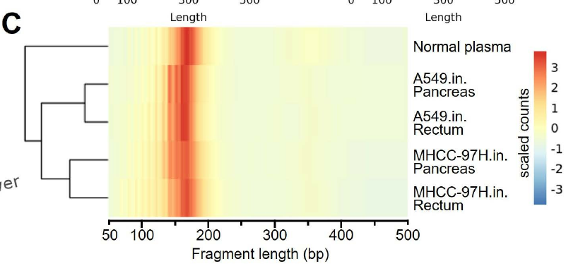

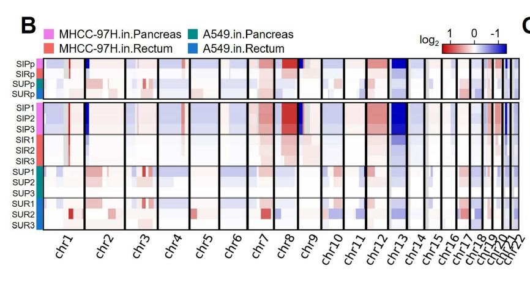

- CANPREDICT weekly meeting [2026-04-08 Wed], Angie shared that normalized cfDNA concentration in serial samples showed a characteristic early high rise and then fall on treatment whereas vehicle was flat.

*** cfDNA isolation optimization
**** Bioanalyzer QC campaign
Bioanalyzer HS DNA assays were performed on cfDNA isolations from serial and terminal bleeds across the JH-2-055 cohort and terminal samples from WU487 and WU225. The campaign spanned 25 runs from 2025-06-03 through 2025-07-25 and covered samples collected between 2024-09-10 and 2024-11-05. Two pilot runs (2024-12-10, 2025-05-01) preceded the production campaign. Raw data are stored at =inputs/bioanalyzer/= and =inputs/bioanalyzer_pilot/=.

|   Run date |    Samples collected | Sample type               |
|------------+----------------------+---------------------------|
| 2025-06-03 |           2024-10-29 | serial                    |
| 2025-06-04 |           2024-10-15 | serial                    |
| 2025-06-05 |           2024-10-01 | serial                    |
| 2025-06-06 |           2024-10-08 | serial                    |
| 2025-06-12 |           2024-10-22 | SPRI pilot + serial (MN2) |
| 2025-06-13 |           2024-10-22 | SPRI trial + serial (MN2) |
| 2025-06-18 |           2024-10-29 | serial                    |
| 2025-06-19 |           2024-10-22 | serial                    |
| 2025-06-20 |    2024-10-22, 10-29 | serial                    |
| 2025-06-23 |    2024-10-22, 10-15 | serial                    |
| 2025-06-23 |           2024-10-08 | serial                    |
| 2025-06-24 |           2024-10-15 | serial                    |
| 2025-06-25 |    2024-10-15, 10-08 | serial                    |
| 2025-06-26 |    2024-10-01, 10-08 | serial                    |
| 2025-06-27 |    2024-10-01, 09-17 | serial                    |
| 2025-06-30 |           2024-09-17 | serial                    |
| 2025-07-09 |           2024-09-17 | serial                    |
| 2025-07-10 |    2024-09-17, 09-10 | serial                    |
| 2025-07-11 |           2024-09-10 | serial                    |
| 2025-07-14 |           2024-09-10 | serial                    |
| 2025-07-15 |           2024-09-10 | serial                    |
| 2025-07-17 |             terminal | WU487 terminal            |
| 2025-07-18 |             terminal | WU487 + WU225 terminal    |
| 2025-07-24 |             terminal | WU225 terminal            |
| 2025-07-25 | 2024-11-05, terminal | WU225 terminal + serial   |

**** TapeStation HSD1000 batch 2 (2025-03-21)
TapeStation HS D1000 QC for species-specific LINE dPCR batch 2. Twelve samples: WU487 terminals (n=5), MN2 terminals (n=2), JH-2-055 serials at days 5, 19, 40, 47, 60 (n=5). Concentrations ranged from 2.84 pg/uL (m25, JH-2-055 serial) to 1500 pg/uL (m8, WU487 terminal). See [[file:nf1-mouse.org::*Species-specific LINE dPCR][Species-specific LINE dPCR]] in Methods.

| Well | Sample | Model    | Type     | Day | Conc (pg/uL) |
|------+--------+----------+----------+-----+--------------|
| B1   | m7     | WU487    | terminal |     |         68.6 |
| C1   | m8     | WU487    | terminal |     |       1500.0 |
| D1   | m9     | WU487    | terminal |     |        379.0 |
| E1   | m10    | WU487    | terminal |     |        150.0 |
| F1   | m11    | WU487    | terminal |     |        209.0 |
| G1   | m12    | MN2      | terminal |     |        245.0 |
| H1   | m25    | JH-2-055 | serial   |   5 |         2.84 |
| A2   | m26    | JH-2-055 | serial   |  19 |         8.48 |
| B2   | m27    | JH-2-055 | serial   |   5 |         11.4 |
| C2   | m28    | JH-2-055 | serial   |  40 |         58.2 |
| D2   | m29    | JH-2-055 | serial   |  47 |         64.2 |
| E2   | m30    | JH-2-055 | serial   |  60 |         35.6 |

*** figure_schema.R
*** Figure strategy
The results Snakemake workflow is mount-aware: large or external files are referenced
from mounts on other systems; otherwise outputs go to =results/<RES_OBJ_ID>/=.
Two sub-pipelines:

- *Summary TSV pipeline* — produces structured tables consumed by the report.
- *Base image pipeline* — produces base-level figures assembled in the report.
*** Running results report
\newcommand{\datadir}{nf1-mouse}
\setcounter{secnumdepth}{0}
\vspace{5mm}
\hfill Last compiled 2026-03-03.
\setcounter{tocdepth}{2}
\tableofcontents
** Reference
- [[id:14780b6a-e3d7-44b1-bb04-0272f9466166][Makefile]]
*** People and contacts
- Angela Hirbe, M.D., Ph.D. — Associate Professor of Medicine and Pediatrics, Director Adult Neurofibromatosis Clinical Program, Division of Oncology/Sarcoma, WashU. CTF grant PI. Manages PDX models and mouse experiments. hirbea@wustl.edu, 314-362-8965.
- Aadel Chaudhuri, M.D., Ph.D. — Mayo Clinic. K08 mentor, cfDNA expertise, co-investigator on NF1 cfDNA projects. Chaudhuri.Aadel@mayo.edu.
- Paul A. Jones — WashU, Hirbe lab. Experience with mouse bleeds, leads PDX experiment execution. paul.a.jones@wustl.edu.
- Guangfeng Wang — WashU, Hirbe lab. First author on JCI FAK+MEK paper (201331-JCI-RG-1). wang.g@wustl.edu.
- Stacey Chamberlain — Nurse Coordinator, Hirbe lab. 314-286-1567.
- Sanita Burgic — Nurse Practitioner, Hirbe lab.
- Tiffany Redden — Senior Grant Specialist, WashU DOM Research Administration. Assigned to CTF AW00010324 progress report. reddent@wustl.edu.
*** Terminology
*** Literature
- Wang et al. "Dual inhibition of FAK and MEK is a therapeutic vulnerability in chromosome 8 gain MPNST" — JCI manuscript 201331-JCI-RG-1 (Guangfeng Wang first author, Angela Hirbe senior). CRISPR screen of all Chr8 genes identified PTK2/FAK as druggable target in Chr8-gain MPNST. Dual FAK+MEK inhibition (defactinib + avutometinib) synergistically effective in Chr8-gain PDX models (MN2, WU-225) but not Chr8-diploid. Major revision requested [2025-11-18 Tue]; revision in progress. Reviewer A comment #4 asked whether Chr8 gain can be monitored serially in mouse blood — this is the direct motivation for our PDX cfDNA read handling and ichorCNA work. Co-authorship offered to Szymanski and Chaudhuri for contributing the cfDNA monitoring data.
- [[id:c6157337-5f4a-4216-abc8-93d1a84cdbb5][PNST MRD]] — post-surgical MRD detection in MPNST using EM-seq + WGS methylation, nucleosome positioning. Sample classification states: cNED, cMRD, cOP, pNED, pMRD, pOD.
- [[id:771f19d4-cd99-4013-b5de-5ba5be6b6d5d][NF1 CAPP-seq]] — targeted sequencing of NF1 cfDNA, CTF publication expected by [2025-10-01]. Repo: [[file:~/repos/nf1-cappseq/nf1-cappseq.org]]
- [[id:36873dd1-7fb7-414c-91b6-9867274a3fd9][cfDNA quantification of cNF burden]] — JHMI/Hopkins IRB, cNF natural history study (NCT04941027) collaboration with Carlos Romo and R. Taylor Sundby
- EM-seq low input validation — technical validation of EM-seq at low cfDNA inputs
- EM-seq WGS fragmentomics validation — combined EM-seq and WGS fragmentomics validation
*** External resources
- [[file:~/repos/nf1-cappseq/nf1-cappseq.org][NF1 CAPP-seq repo]]
- [[id:4e0ba57c-5b29-4ef7-8f82-f84008cfe8ee][CTF Private Donor MPNST LDT]] — CTF-funded two-track clinical/research LDT using CHLA LBSeq4Kids assay
- [[https://wustl.box.com/s/jdkh9q3cdh80abyk6983y2adc0gccn25][WashU Box — mouse plasma sample bank]]
*** Bibliography
#+BEGIN_SRC bibtex :tangle ./resources/nf1-mouse.bib :comments no
@misc{magmax_manual,
  title        = {MagMAX Cell-Free DNA Isolation Kit User Guide},
  author       = {{Thermo Fisher Scientific}},
  year         = {2023},
  note         = {Document Number MAN0015629},
  howpublished          = {\url{https://assets.thermofisher.com/TFS-Assets/LSG/manuals/MAN0015629_MagMAX_CellFree_DNA_Isola_UB.pdf}},
  urldate      = {2024-11-21}
}

@misc{NEB2024,
  title        = {Enzymatic Methyl-seq Kit: Instruction Manual},
  author       = {{New England Biolabs}},
  year         = {2024},
  howpublished       = {\url{https://www.neb.com/en-us/-/media/nebus/files/manuals/manuale7120.pdf}},
  url          = {https://www.neb.com/en-us/-/media/nebus/files/manuals/manuale7120.pdf},
  note         = {Accessed: 2024-11-21},
}

@manual{qubit,
  title        = {Qubit 1X dsDNA HS Assay Kit User Guide},
  author       = {Thermo Fisher Scientific},
  year         = {2024},
  howpublished          = {https://assets.thermofisher.com/TFS-Assets/LSG/manuals/MAN0017455_Qubit_1X_dsDNA_HS_Assay_Kit_UG.pdf},
  note         = {Accessed: 2024-11-22},
}

@misc{nanodrop,
  title        = {NanoDrop One User Guide},
  author       = {Thermo Fisher Scientific},
  year         = {2024},
  howpublished = {\url{https://tools.thermofisher.com/content/sfs/manuals/3091-NanoDrop-One-Help-UG-en.pdf}},
  note         = {Accessed: 2024-11-22},
}

#+END_SRC
** Direct vs Disambiguate PDX read assignment                   :bioinfo_dev:
:PROPERTIES:
:ID:       46aa7d0a-577a-4d6d-85d0-122ad93bbd9e
:header-args:bash: :dir /home/jeszyman/repos/nf1-mouse/dev/pdx-read-handling
:header-args:jupyter-R: :session direct-vs-disambig :kernel biotools :async yes :dir /home/jeszyman/repos/nf1-mouse/dev/direct-vs-disambiguate
:END:

*** Data

| File                                                      | Contents                                  | Notes                                          |
|-----------------------------------------------------------+-------------------------------------------+------------------------------------------------|
| =/mnt/data/projects/nf1-mouse/emseq/fastqs/lib06{22..39}/=  | PE150 EM-seq FASTQs, 18 PDX mouse samples | 6 WU-487 terminal + 12 JH-2-055 serial bleeds  |
| =/mnt/data/projects/nf1-mouse/ref/biscuit/ncbi_hg38_noalt/= | hg38 no-alt analysis set, BISCUIT indexed | NCBI GRCh38, chr-prefixed, no ALTs, no decoys  |
| =/mnt/data/projects/nf1-mouse/ref/biscuit/ucsc_mm10/=       | mm10 primary assembly, BISCUIT indexed    | UCSC, chr-prefixed, 66 contigs, needs download |

*** Design: two strategies
**** Strategy 1: Direct-to-human
Align all reads to hg38 with BISCUIT. Mouse reads fail to map or map with low MAPQ. Simplest approach, used by NCI pipeline. Risk: mouse reads with homologous human regions create false alignments.

#+begin_src bash :tangle ./dev/pdx-read-handling/01_strategy1_direct.sh
#!/usr/bin/env bash
set -euo pipefail
# Strategy 1: Direct BISCUIT alignment to hg38
# Env: emseq (biscuit + samtools)

SAMPLE=$1
THREADS=${2:-8}
REF="/mnt/data/projects/nf1-mouse/ref/biscuit/ncbi_hg38_noalt/GCA_000001405.15_GRCh38_no_alt_analysis_set.fna"
FASTQ_DIR="/mnt/data/projects/nf1-mouse/emseq/fastqs/${SAMPLE}"
OUTDIR="/mnt/data/projects/nf1-mouse/emseq/pdx-read-handling/strategy1/${SAMPLE}"
mkdir -p "$OUTDIR"

R1=$(ls "${FASTQ_DIR}"/*_R1_001.fastq.gz)
R2=$(ls "${FASTQ_DIR}"/*_R2_001.fastq.gz)

biscuit align -@ "$THREADS" "$REF" "$R1" "$R2" \
  | samtools sort -@ "$THREADS" -o "${OUTDIR}/${SAMPLE}.hg38.sorted.bam"

samtools index "${OUTDIR}/${SAMPLE}.hg38.sorted.bam"
samtools flagstat "${OUTDIR}/${SAMPLE}.hg38.sorted.bam" > "${OUTDIR}/${SAMPLE}.hg38.flagstat.txt"
samtools idxstats "${OUTDIR}/${SAMPLE}.hg38.sorted.bam" > "${OUTDIR}/${SAMPLE}.hg38.idxstats.txt"
#+end_src

**** Strategy 3: Disambiguate
Align independently to hg38 and mm10 with BISCUIT. Compare NM tags to assign each read pair to the species with fewer true mismatches. BISCUIT separates conversion mismatches (ZC tag) from true mismatches (NM tag).

#+begin_src bash :tangle ./dev/pdx-read-handling/03_strategy3_disambiguate.sh
#!/usr/bin/env bash
set -euo pipefail
# Strategy 3: Disambiguate via dual BISCUIT alignment
# Env: emseq (biscuit + samtools)
# BISCUIT NM tag = true mismatches only (conversion in ZC tag)

SAMPLE=$1
THREADS=${2:-8}
HG38_REF="/mnt/data/projects/nf1-mouse/ref/biscuit/ncbi_hg38_noalt/GCA_000001405.15_GRCh38_no_alt_analysis_set.fna"
MM10_REF="/mnt/data/projects/nf1-mouse/ref/biscuit/ucsc_mm10/mm10.fa"
FASTQ_DIR="/mnt/data/projects/nf1-mouse/emseq/fastqs/${SAMPLE}"
OUTDIR="/mnt/data/projects/nf1-mouse/emseq/pdx-read-handling/strategy3/${SAMPLE}"
mkdir -p "$OUTDIR"

R1=$(ls "${FASTQ_DIR}"/*_R1_001.fastq.gz)
R2=$(ls "${FASTQ_DIR}"/*_R2_001.fastq.gz)

# Align to human
biscuit align -@ "$THREADS" "$HG38_REF" "$R1" "$R2" \
  | samtools sort -@ "$THREADS" -o "${OUTDIR}/${SAMPLE}.hg38.sorted.bam"
samtools index "${OUTDIR}/${SAMPLE}.hg38.sorted.bam"

# Align to mouse
biscuit align -@ "$THREADS" "$MM10_REF" "$R1" "$R2" \
  | samtools sort -@ "$THREADS" -o "${OUTDIR}/${SAMPLE}.mm10.sorted.bam"
samtools index "${OUTDIR}/${SAMPLE}.mm10.sorted.bam"

# Disambiguate: compare NM tags, assign to species with fewer mismatches
python3 "$(dirname "$0")/disambiguate.py" \
  --human-bam "${OUTDIR}/${SAMPLE}.hg38.sorted.bam" \
  --mouse-bam "${OUTDIR}/${SAMPLE}.mm10.sorted.bam" \
  --out-prefix "${OUTDIR}/${SAMPLE}" \
  --threads "$THREADS"

samtools flagstat "${OUTDIR}/${SAMPLE}.hg38.sorted.bam" > "${OUTDIR}/${SAMPLE}.hg38.flagstat.txt"
samtools flagstat "${OUTDIR}/${SAMPLE}.mm10.sorted.bam" > "${OUTDIR}/${SAMPLE}.mm10.flagstat.txt"
samtools flagstat "${OUTDIR}/${SAMPLE}.disambig.human.bam" > "${OUTDIR}/${SAMPLE}.disambig.human.flagstat.txt"
#+end_src

*** Production run: alignment benchmarks

BISCUIT 1.8.0 alignment on GCP n2-highmem (224 vCPU, 220 GB RAM), conda env =nf1-mouse=.

**** Per-sample input scale

Each EM-seq library is ~71 GB compressed (R1+R2), ~380M read pairs (PE150).
BISCUIT processes reads in fixed batches of 529,802 sequences (264,901 read pairs), yielding ~1,430 batches per sample.

**** Throughput
- ~710 read pairs/sec/thread (bisulfite-aware alignment to hg38 no-alt, 195 contigs)
- 8 threads per process: ~5,680 read pairs/sec, ~370 sec (6.2 min) wall time per batch
- Pace is constant from batch 1 through batch 1,062+: mean 370 sec, range 305–438 sec
- No degradation over multi-day runs

**** Reference context
| Aligner            | Typical rate (reads/sec/thread) | Notes                  |
|--------------------+---------------------------------+------------------------|
| BWA-MEM2 (genomic) | 3,000–5,000                     | Non-bisulfite          |
| BISCUIT (EM-seq)   | 700–1,000                       | C→T conversion-aware   |
| Bismark (bowtie2)  | 200–400                         | Three-letter alignment |

BISCUIT at 710 reads/sec/thread is within expected range for bisulfite-aware whole-genome alignment. The ~5× slowdown relative to standard BWA-MEM reflects the additional cost of handling C→T converted reads on both strands.

**** Resource usage per BISCUIT process
- RAM: ~25 GB (BWT + SA arrays for hg38 no-alt)
- CPU: 800% (8 threads, fully saturated)
- Sort temp files: ~1.4 GB each, ~15 files per sample at peak (samtools sort -T on /mnt/data)
- Final sorted BAM: TBD (first sample completing)

**** Wall time estimates (hg38 alignment, Strategy 1)
- Per sample: ~1,430 batches × 370 sec ÷ 3,600 = ~147 hrs (~6 days) at 8 threads
- With 6 parallel processes (150 GB RAM): 18 samples ÷ 6 = 3 waves × ~6 days = ~18 days
- Limiting factor: RAM (25 GB/process), not CPU (224 vCPUs available, using 48)

**** BISCUIT header truncation bug (v1.8.0)
BISCUIT 1.8.0 truncates =@SQ= header lines for references with long contig names (e.g., =chrUn_KI270302v1= → =chrUn_KI2=, missing =LN:= tag). Workaround: pipe through =samtools view -bS -t ref.fai= to inject correct =@SQ= lines from the =.fai= file before sorting. This bug affected the NCBI hg38 no-alt reference (195 contigs, many with names >10 chars); UCSC mm10 (66 contigs) may also be affected.

*** Comparison metrics

#+begin_src bash :tangle ./dev/pdx-read-handling/04_compare.sh
#!/usr/bin/env bash
set -euo pipefail
# Compare strategies across all samples
# Collect: total read pairs (from FASTQ), mapped, MAPQ>=30, human-assigned, ambiguous rate

BASEDIR="/mnt/data/projects/nf1-mouse/emseq/pdx-read-handling"
OUTFILE="${BASEDIR}/comparison.tsv"

echo -e "sample\tstrategy\ttotal_read_pairs\tmapped_reads\tmapq30_reads\thuman_reads\tambiguous_reads\tambiguous_pct" > "$OUTFILE"

for SAMPLE in lib0622 lib0623 lib0624 lib0625 lib0626 lib0627 \
              lib0628 lib0629 lib0630 lib0631 lib0632 lib0633 \
              lib0634 lib0635 lib0636 lib0637 lib0638 lib0639; do

  # Count total read pairs from FASTQ (shared denominator for both strategies)
  FASTQ_DIR="/mnt/data/projects/nf1-mouse/emseq/fastqs/${SAMPLE}"
  if [ -d "$FASTQ_DIR" ]; then
    TOTAL_PAIRS=$(zcat "${FASTQ_DIR}"/*_R1_001.fastq.gz | awk 'NR%4==1' | wc -l)
  else
    continue
  fi

  # Strategy 1
  S1_BAM="$BASEDIR/strategy1/${SAMPLE}/${SAMPLE}.hg38.sorted.bam"
  if [ -f "$S1_BAM" ]; then
    MAPPED=$(samtools view -c -F 4 "$S1_BAM")
    MAPQ30=$(samtools view -c -F 4 -q 30 "$S1_BAM")
    echo -e "${SAMPLE}\tstrategy1_direct\t${TOTAL_PAIRS}\t${MAPPED}\t${MAPQ30}\t${MAPQ30}\t0\t0.0" >> "$OUTFILE"
  fi

  # Strategy 3
  S3_SUMMARY="$BASEDIR/strategy3/${SAMPLE}/${SAMPLE}.disambig.summary.txt"
  S3_BAM="$BASEDIR/strategy3/${SAMPLE}/${SAMPLE}.disambig.human.bam"
  S3_HG38="$BASEDIR/strategy3/${SAMPLE}/${SAMPLE}.hg38.sorted.bam"
  if [ -f "$S3_SUMMARY" ]; then
    MAPPED=$(samtools view -c -F 4 "$S3_HG38")
    HUMAN=$(awk -F'\t' '$1=="human_assigned"{print $2}' "$S3_SUMMARY")
    AMBIG=$(awk -F'\t' '$1=="ambiguous"{print $2}' "$S3_SUMMARY")
    AMBIG_PCT=$(awk -F'\t' '$1=="ambiguous_pct"{print $2}' "$S3_SUMMARY")
    MAPQ30=$(samtools view -c -F 4 -q 30 "$S3_BAM")
    echo -e "${SAMPLE}\tstrategy3_disambig\t${TOTAL_PAIRS}\t${MAPPED}\t${MAPQ30}\t${HUMAN}\t${AMBIG}\t${AMBIG_PCT}" >> "$OUTFILE"
  fi
done

echo "Comparison written to $OUTFILE"
cat "$OUTFILE" | column -t
#+end_src

*** Result summary

*** Ideas
- Divergence-vs-ambiguity QC: use reads classified differently between strategies as positive control for evaluating separation quality
- Library complexity (preseq) as limiting factor for downstream ichorCNA — check after alignment
- Extend to serial bleeds after terminal bleed evaluation settles
- Effect of ambiguous-to-human on ichorCNA: run ichorCNA on Strategy 3A (discard ambiguous) vs 3B (ambiguous → human) and compare CNA profiles — does the extra 12% coverage change segment calls or tumor fraction estimates?
- Overall CNA comparison across all three strategies (direct, disambiguate-discard, disambiguate-plus-ambiguous) to quantify how read assignment method affects copy number inference
- LINE dPCR cross-validation: for JH-2-055 serial samples (where dPCR works), correlate EM-seq human fraction with dPCR human LINE fraction across strategies

** Running results report
:PROPERTIES:
:ID:       09de27fb-9be9-46d3-a1b3-db7bb11710e3
:EXPORT_FILE_NAME: ./running_results
:EXPORT_TITLE: NF1 MPNST PDX cfDNA Running Results
:EXPORT_AUTHOR: Jeffrey Szymanski
:EXPORT_OPTIONS: toc:t num:t html-style:nil html-postamble:"

Last compiled %T
"
:EXPORT_HTML_HEAD: <link rel="stylesheet" type="text/css" href="resources/org.css"/>
:EXPORT_HTML_HEAD_EXTRA:  <link rel="stylesheet" href="https://cdnjs.cloudflare.com/ajax/libs/highlight.js/11.9.0/styles/github.min.css"/>   
:END:
#+bibliography: resources/nf1-mouse.bib
#+cite_export: csl resources/apa-numeric-superscript-brackets.csl
*** Document reference                                             :noexport:
- [[file:running_results.html][Running Results Report HTML]]
- Export: open this heading, =C-c C-e= then =h s= (HTML subtree export)
*** Background
*** Methods
*** Results
**** ICRG combined reference failure
ICRG (concatenated hg38+mm10 reference, chromosome filtering) achieves 99.9% accuracy for WES, RRBS, and RNA-seq [cite:@callari2018] but fails catastrophically for whole-genome EM-seq. In two WU-487 terminal bleed PDX samples (lib0625, lib0626; 3M read pairs each), ICRG assigned <1% of reads to human chromosomes despite Disambiguate identifying 17-20% human content.

The failure has two components: (1) mouse contigs score 1-3 points higher than human orthologs for ~30% of ambiguous reads, and (2) among reads with identical alignment scores (AS==XS), 96% are assigned to mouse chromosomes rather than the expected ~50% from random tie-breaking. Both effects correlate with bisulfite conversion count (ZC tag) — reads with heavy C→T conversion are almost exclusively routed to mouse.

The likely mechanism is that EM-seq C→T conversion at unmethylated CpGs reduces the effective sequence alphabet, collapsing species-distinguishing variants at orthologous loci. RRBS avoids this by targeting only CpG-island-enriched fragments (~1-3% of genome). ICRG is not viable for whole-genome EM-seq PDX read handling; Disambiguate with BISCUIT (conversion-corrected NM tags) is the recommended approach.
*** References
#+print_bibliography:

** Sub-50M cohort CNA analysis                                  :bioinfo_dev:
:PROPERTIES:
:ID:       36229d93-58ae-4aec-8100-0465fed46a6a
:header-args:jupyter-R: :session cna-sub50M :kernel biotools :async yes :dir ./dev/cna-sub50M
:EXPORT_FILE_NAME: ./cna-sub50M-analysis
:EXPORT_TITLE: PDX Read Handling: Sub-50M Cohort CNA Analysis
:EXPORT_OPTIONS: toc:t num:t html-style:nil
:EXPORT_HTML_HEAD: <link rel="stylesheet" type="text/css" href="resources/org.css"/>
:END:

*** Background

Patient-derived xenograft (PDX) models engraft human tumor tissue in immunocompromised mice, enabling translational studies of circulating cell-free DNA (cfDNA) as a biomarker for tumor monitoring. However, cfDNA isolated from PDX mouse plasma contains a mixture of human tumor-derived and mouse host-derived fragments. Because approximately 85% of the mouse and human genomes share sequence homology, mouse-origin reads can map to the human reference with high alignment scores and pass standard quality filters (MAPQ >= 20), creating systematic contamination in downstream copy number analysis.

This notebook evaluates three PDX read handling strategies for cfDNA copy number alteration (CNA) analysis using 50-million read-pair subsets from 6 WU-487 MPNST terminal bleeds. Strategy 1 (S1) aligns reads directly to hg38 without species filtering. Strategy 3A (S3A) uses NM-tag-based disambiguation [cite:@ahdesmaki2017] to retain only reads that align better to the human than mouse reference. Strategy 3B (S3B) extends S3A by including ambiguous reads (those with equal alignment scores to both references). All strategies use the BISCUIT aligner [cite:@zhou2024] uniformly to avoid confounding by aligner choice [cite:@bhandari2025]. Tumor fraction is estimated using ichorCNA [cite:@adalsteinsson2017].

Disambiguation classifies reads by comparing the NM tag (number of true mismatches, excluding C-to-T conversion events) between hg38 and mm10 alignments for each read pair. BISCUIT separates conversion mismatches (ZC tag) from true mismatches (NM tag), making the NM comparison unbiased by methylation state — a critical requirement for EM-seq data. Reads with fewer mismatches to hg38 are classified as human; fewer to mm10 as mouse; equal NM values as ambiguous. No minimum NM difference threshold is applied — a single-mismatch advantage is sufficient for classification.

The WU-487 PDX line is an NF1-associated malignant peripheral nerve sheath tumor (MPNST) characterized by biallelic NF1 loss and PRC2 inactivation (SUZ12 loss), resulting in loss of H3K27me3 [cite:@heidrich2022]. This line is Chr8q-WT (no Chr8q gain), providing a negative control for CNA detection at that locus. Key MPNST CNA loci include CDKN2A/B deletion (9p21), TP53 alteration (17p13), NF1 loss (17q11), and PRC2 component deletions (SUZ12 at 17q11, EED at 11q14, EZH2 at 7q36).

*** Data
**** Sample cohort

Six WU-487 terminal bleeds from NRG mice: 3 vehicle-treated (mou0001-mou0003, collected 2024-08-20, day 63 post-implant) and 3 mirdametinib-treated (mou0004-mou0006, collected 2024-08-30, day 72 post-implant). EM-seq libraries were prepared using NEBNext EM-seq and sequenced to approximately 380M read pairs each. For this evaluation, 50M read-pair subsets were extracted (no deduplication, 0% duplicate rate). At 50M input read pairs, the effective human coverage after disambiguation (S3A) is approximately 0.3-0.7x hg38, reflecting the ~18-22% human read fraction. ichorCNA operates at 1 Mb bins, where even sub-1x coverage provides sufficient read counts per bin (~10-20 reads/Mb) for copy number estimation.

| lib_id  | mouse_id | treatment    | tumor vol (mm^{3}) | body wt (g) | cfDNA (pg/uL) |
|---------+----------+--------------+--------------------+-------------+---------------|
| lib0622 | mou0001  | vehicle      | 1,823              |          23 |           467 |
| lib0623 | mou0002  | vehicle      | 1,410              |          26 |           536 |
| lib0624 | mou0003  | vehicle      | 1,048              |          26 |           111 |
| lib0625 | mou0004  | mirdametinib | 1,902              |          23 |         1,720 |
| lib0626 | mou0005  | mirdametinib | 2,380              |          21 |         2,380 |
| lib0627 | mou0006  | mirdametinib | 2,551              |          27 |           387 |

**** Tumor growth curves

Longitudinal tumor volume measurements are available for all 6 mice from implantation to terminal bleed.

#+begin_src jupyter-R :results output graphics file :file plots/tumor_growth_curves.png :width 14 :height 6 :units in :res 200
source("14_tumor_growth_curves.R")
#+end_src

#+CAPTION: Longitudinal tumor growth curves for 6 WU-487 PDX mice. Vehicle (blue) collected day 63 post-implant; mirdametinib (red) collected day 72.
#+ATTR_ORG: :width 800
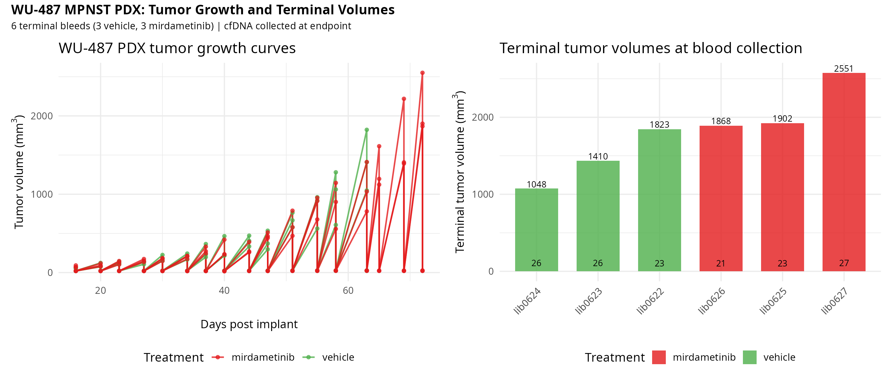

All tumors reached substantial volumes at endpoint (1,048-2,551 mm^{3}). The mirdametinib-treated mice were collected 9 days later than vehicle controls (day 72 vs day 63 post-implant), and their terminal tumor volumes are comparable to or larger than vehicle. This longer implantation period confounds any treatment effect interpretation — the larger mirdametinib-arm tumors may reflect additional growth time rather than treatment failure. Tumor volumes ranged 2.4-fold across the cohort.

**** Data sources

- BAMs (3 strategies x 6 samples = 18): =/mnt/gcs/jeszyman/projects/nf1-mouse/emseq/pdx-read-handling-sub50M/=
- ichorCNA rerun (108 runs: 6 samples x 3 strategies x 3 presets x 2 PoN): =/mnt/data/projects/nf1-mouse/emseq/cna-sub50M-rerun/=
- Metadata: =data/metadata.xlsx= (6 relational sheets)

*** Read assignment

Disambiguate classifies each read pair into human-assigned, mouse-assigned, or ambiguous based on alignment score comparison (NM tag) from dual-reference BISCUIT alignment. This section examines the species composition of the 50M read-pair input across all samples.

#+begin_src jupyter-R :results output graphics file :file plots/fig1_species_classification.png :width 8 :height 6 :units in :res 300
source("18_improved_figures.R")
#+end_src

#+CAPTION: Disambiguate species classification of 50M read-pair subsets.
#+ATTR_ORG: :width 800
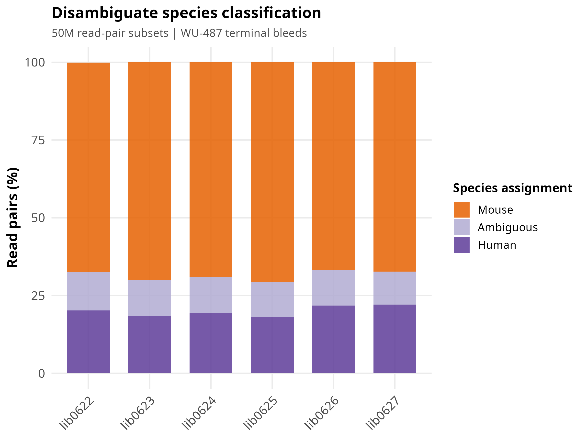

Across all 6 samples, 67-71% of read pairs are mouse-assigned and only 18-22% are human-assigned, with 11-12% ambiguous. This species composition is consistent across treatment arms and reflects the expected dominance of host-derived cfDNA in PDX plasma. The uniformity of species ratios across samples indicates that technical variability in library preparation and sequencing does not substantially affect species classification.

**** Human fraction vs cfDNA concentration

#+begin_src jupyter-R :results output graphics file :file plots/human_pct_vs_cfdna.png :width 7 :height 5 :units in :res 150
source("02_read_assignment.R")
#+end_src

#+CAPTION: Human read fraction vs cfDNA input concentration.
#+ATTR_ORG: :width 600
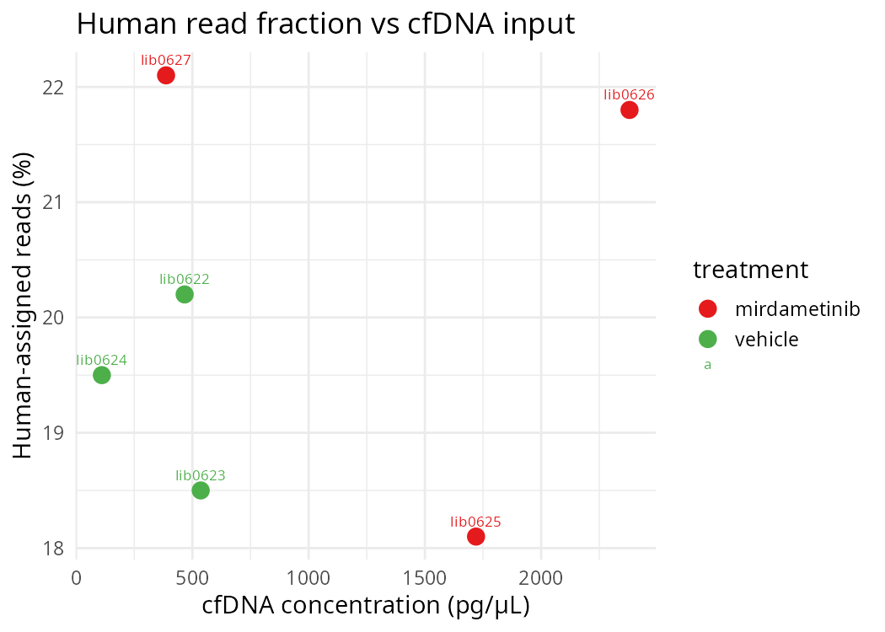

lib0626 and lib0627 show slightly higher human read fractions (21.8% and 22.1%) compared to other samples (18.1-20.2%). These two samples also have the highest ichorCNA tumor fractions after disambiguation (see below), suggesting that elevated tumor-derived cfDNA contributes modestly more human reads to the total pool.

*** Alignment metrics

#+begin_src jupyter-R :results output graphics file :file plots/mapped_reads.png :width 10 :height 5 :units in :res 150
source("03_alignment_metrics.R")
#+end_src

#+CAPTION: Mapped reads per strategy across all samples.
#+ATTR_ORG: :width 800
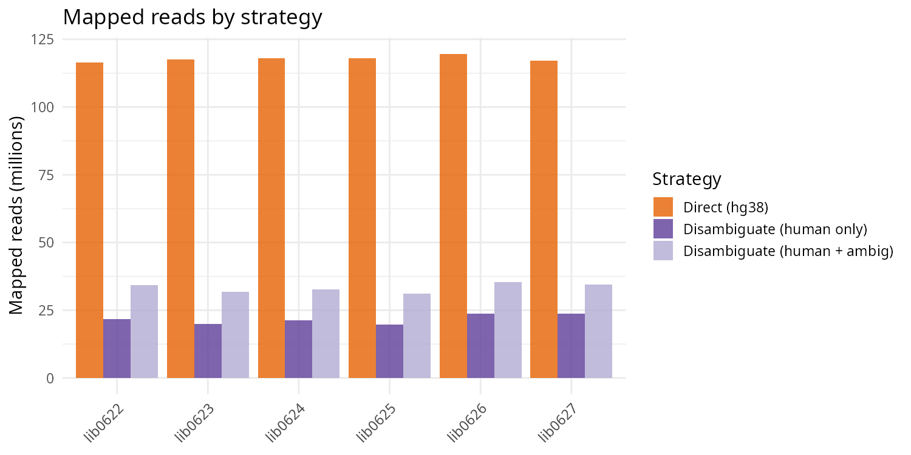

Strategy 1 retains approximately 117-120M mapped reads per sample (both reads of all 50M pairs that map anywhere to hg38). After disambiguation, S3A retains approximately 20-24M mapped reads (human-only), and S3B retains 31-35M (human + ambiguous). The 5-6-fold reduction from S1 to S3A reflects the removal of the ~67-71% mouse contamination plus the ~11% ambiguous reads.

**** Read retention relative to S1

#+begin_src jupyter-R :results output graphics file :file plots/retention_vs_s1.png :width 10 :height 5 :units in :res 150
source("03_alignment_metrics.R")
#+end_src

#+CAPTION: Read retention relative to Strategy 1 direct alignment.
#+ATTR_ORG: :width 800
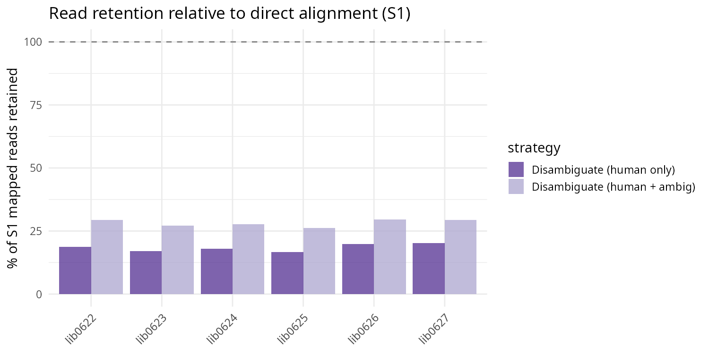

S3A retains 17-20% of S1's mapped reads. S3B retains 27-30%. The consistency across samples confirms that species classification is not sample-dependent and reflects the stable mouse-to-human ratio in PDX plasma cfDNA.

*** Read overlap analysis

To directly quantify mouse contamination in Strategy 1, we performed exact read-name overlap analysis on lib0626. Every read passing MAPQ >= 20 in S1 was cross-referenced against disambiguate category assignments.

#+begin_src jupyter-R :results output graphics file :file plots/fig2_s1_contamination.png :width 5 :height 7 :units in :res 300
source("18_improved_figures.R")
#+end_src

#+CAPTION: True species composition of S1 MAPQ>=20 reads (lib0626, exact read-name overlap with disambiguate).
#+ATTR_ORG: :width 600
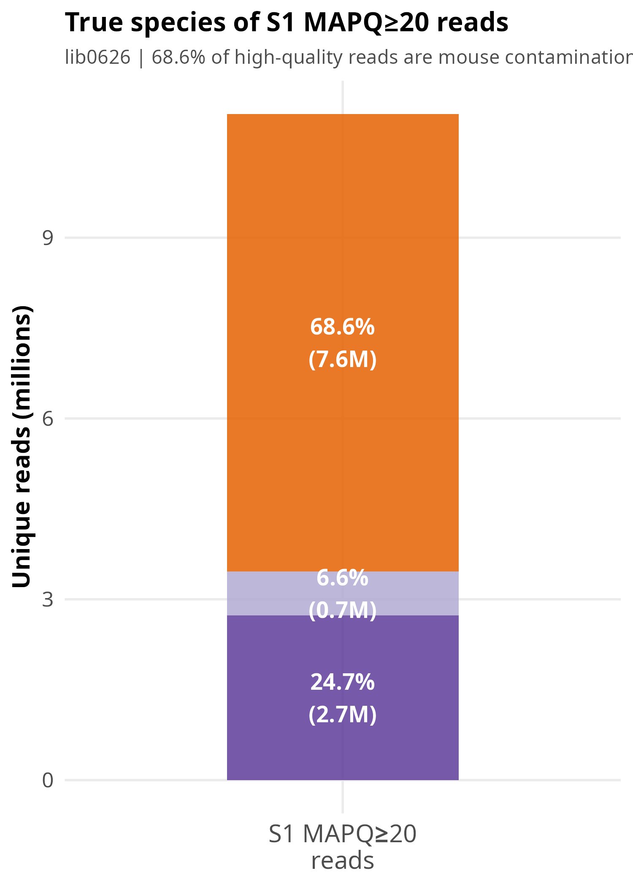

Of the 11.1M reads that pass S1's MAPQ >= 20 filter in lib0626, 68.6% are classified as mouse by disambiguate, 24.7% as human, and 6.6% as ambiguous. This demonstrates that mouse reads from conserved genomic regions produce hg38 alignment scores sufficient to pass standard quality filters, making MAPQ-based filtering alone inadequate for PDX cfDNA analysis.

**** Comprehensive read mapping figure

#+begin_src jupyter-R :results output graphics file :file plots/read_mapping_comprehensive.png :width 14 :height 12 :units in :res 150
source("12_read_mapping_figure.R")
#+end_src

#+CAPTION: Comprehensive read mapping summary: strategy yields (A), species classification (B).
#+ATTR_ORG: :width 800
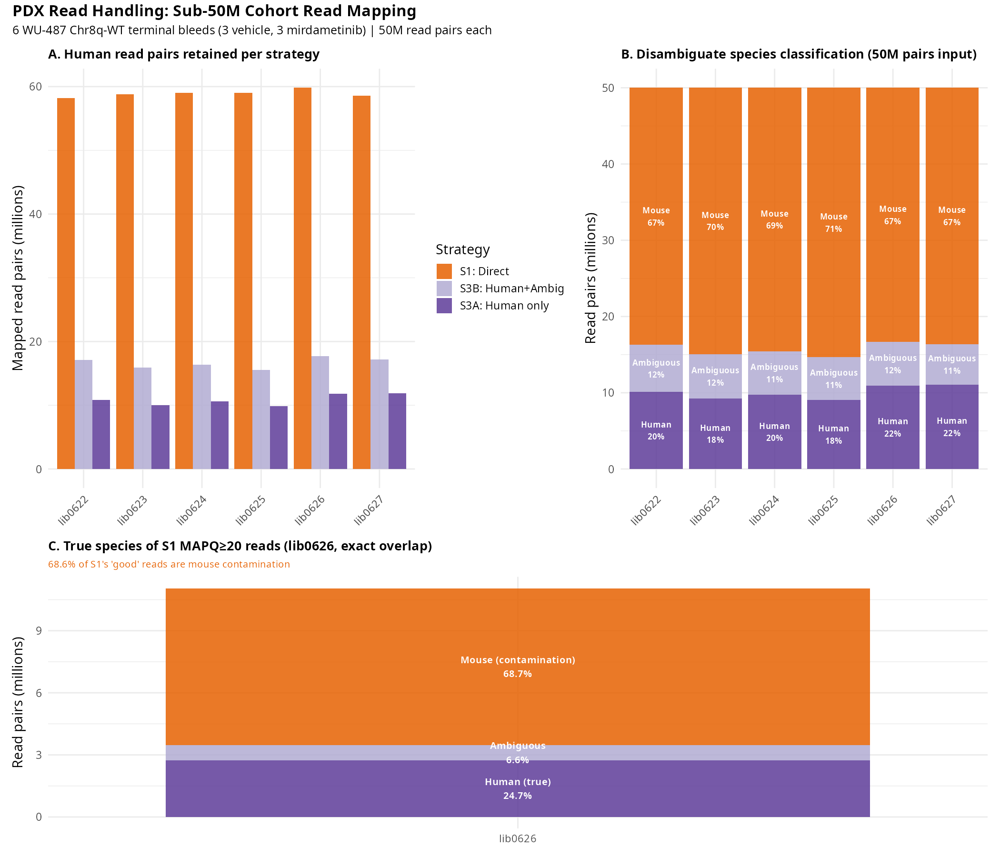

The three-panel figure summarizes the PDX read handling comparison. Panel A shows that S1 retains 5-6 times more "human" read pairs than S3A, but this excess consists primarily of mouse contamination. Panel B shows the disambiguate species classification revealing that the majority of reads in every sample are mouse-origin. Panel C demonstrates for lib0626 that 68.6% of reads passing S1's MAPQ >= 20 quality filter are actually mouse reads.

*** Fragment length profiles

Fragment length distributions distinguish cfDNA from genomic DNA: tumor-derived cfDNA produces a characteristic mono-nucleosomal peak near 167 bp, while mouse genomic DNA contamination produces a broader, non-periodic distribution.

**** Raw count histograms

#+begin_src jupyter-R :results output graphics file :file plots/fragment_histograms.png :width 14 :height 12 :units in :res 150
source("13_fragment_histograms.R")
#+end_src

#+CAPTION: Fragment length distributions by strategy (raw read pair counts, 1% subsample).
#+ATTR_ORG: :width 800
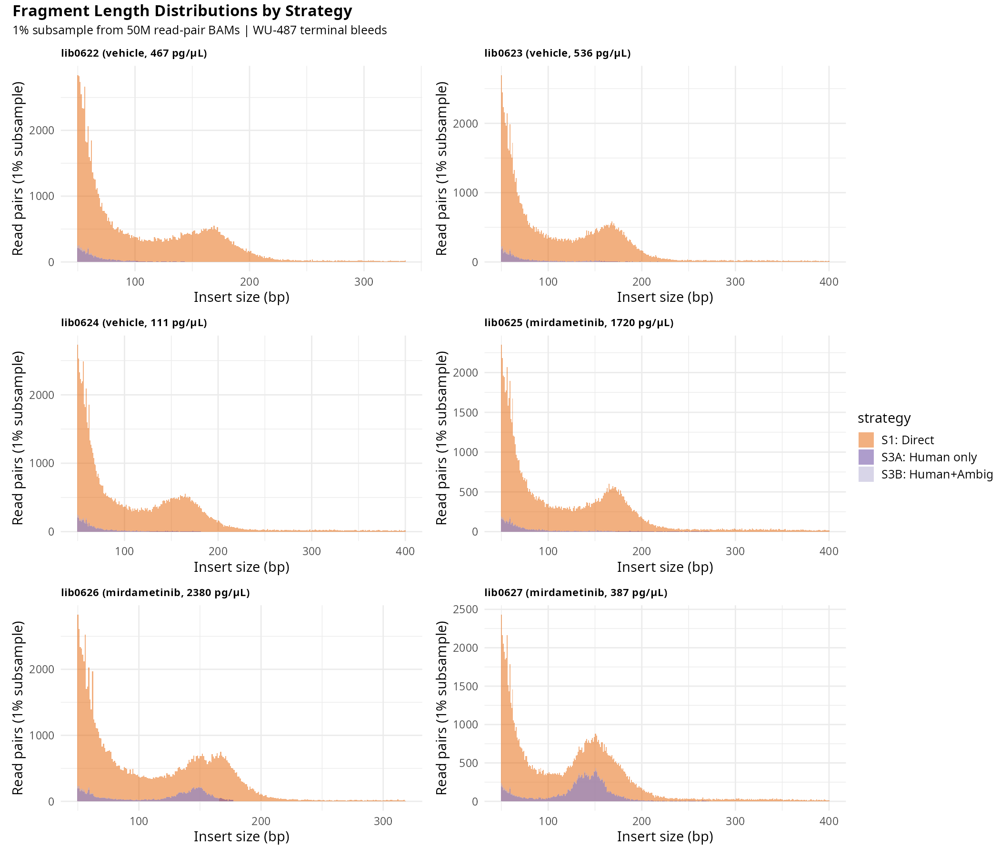

In raw counts, S1 dominates all samples because it retains 5-6 times more reads. However, only lib0626 and lib0627 show a discernible mono-nucleosomal peak in the S3A distribution, consistent with their elevated tumor fractions. The remaining 4 samples show minimal structure after disambiguation, consistent with low tumor content.

**** Percent-normalized histograms

#+begin_src jupyter-R :results output graphics file :file plots/fragment_histograms_pct.png :width 14 :height 12 :units in :res 150
source("13b_fragment_histograms_pct.R")
#+end_src

#+CAPTION: Fragment length distributions normalized to percent of total per strategy.
#+ATTR_ORG: :width 800
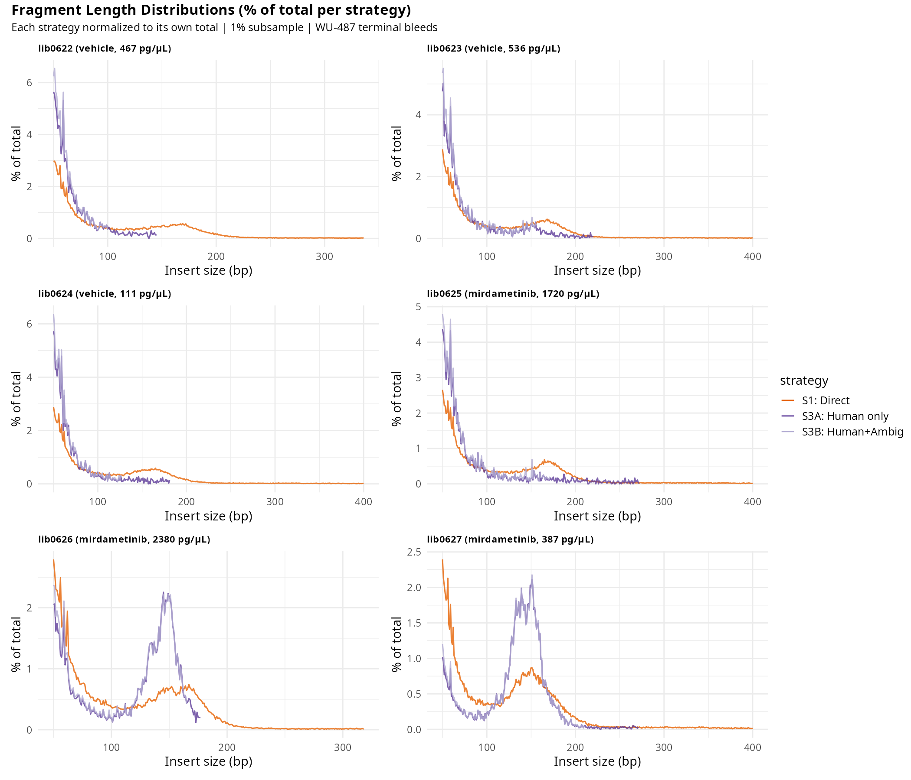

Normalizing each strategy to its own total reveals a key nuance. For the two high-TF samples (lib0626, lib0627), S3A shows a pronounced 167 bp mono-nucleosomal peak — S3A has 23-28% of reads in the 150-180 bp peak region vs 19% for S1, indicating that disambiguation enriches for the cfDNA nucleosomal signal by removing the mouse genomic background. However, for low-TF samples (lib0622-lib0625), the pattern reverses: S3A has a LOWER peak fraction (3-7%) than S1 (15-17%). This is because in low-TF samples, human reads surviving disambiguation are predominantly host white blood cell genomic DNA, not tumor cfDNA. Disambiguation removes mouse contamination but does not enrich for human tumor content — it simply reveals whatever human DNA is present, which in low-TF samples is mostly non-cfDNA.

**** High-TF vs low-TF fragment comparison

#+begin_src jupyter-R :results output graphics file :file dev/cna-sub50M/plots/fragment_pub.png :width 12 :height 12 :units in :res 300
source("23_fragment_pub.R")
#+end_src

#+CAPTION: Fragment length comparison: high-TF vs low-TF samples across strategies.
#+ATTR_ORG: :width 800
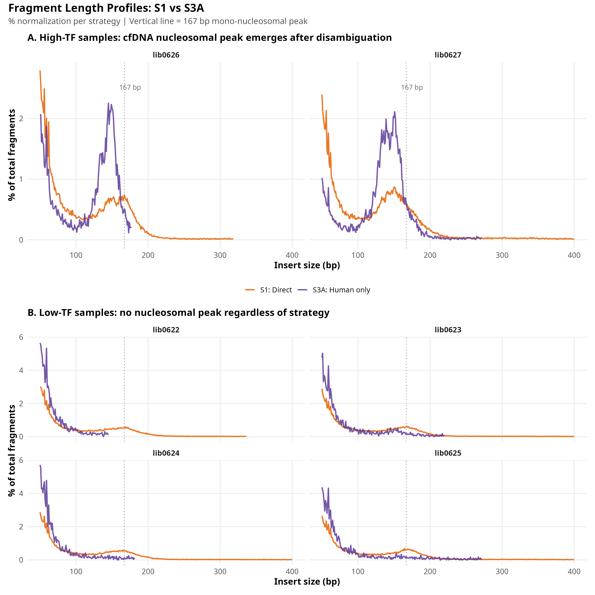

This focused comparison isolates the key finding: for high-TF samples (lib0626, lib0627), S3A reveals a clear mono-nucleosomal peak at 167 bp that is hidden in S1 by the overwhelming mouse genomic DNA background. For low-TF samples, neither strategy produces a nucleosomal peak, confirming that the nucleosomal signature requires sufficient tumor-derived cfDNA to be detectable above the background. The 167 bp peak corresponds to the canonical cfDNA fragment length protected by a single nucleosome plus linker histone, a hallmark of apoptotic cell-free DNA release from tumor cells.

*** Tumor fraction estimation

ichorCNA was run across all combinations of 3 strategies, 3 presets (default-low-input, aggressive, permissive), and 2 panel-of-normals settings (nopon, withpon), for a total of 108 runs on autosomes only.

**** PoN effect

#+begin_src jupyter-R :results output graphics file :file plots/pon_effect.png :width 14 :height 5 :units in :res 150
source("05_tumor_fraction.R")
#+end_src

#+CAPTION: Effect of panel of normals on tumor fraction estimates (default-low-input preset).
#+ATTR_ORG: :width 800
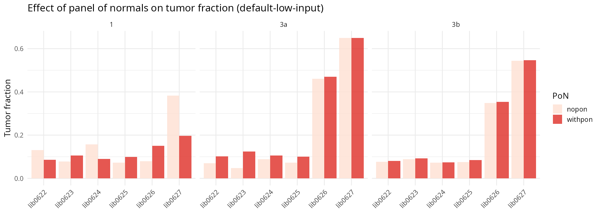

The PoN has a large effect on S1 (vehicle arm CV drops from 0.33 to 0.11) but minimal effect on disambiguated strategies S3A and S3B. This is expected: PoN corrects for systematic bin-level coverage biases, but after disambiguation these biases are already reduced because the mouse contamination that contributed to them has been removed. The PoN is essential for S1 but largely redundant for S3A/S3B, which achieve comparable consistency without it.

**** Tumor fraction by strategy

#+begin_src jupyter-R :results output graphics file :file plots/fig3_tf_comparison.png :width 10 :height 7 :units in :res 300
source("18_improved_figures.R")
#+end_src

#+CAPTION: Tumor fraction estimates by strategy (default-low-input preset, with PoN, autosomes only).
#+ATTR_ORG: :width 800
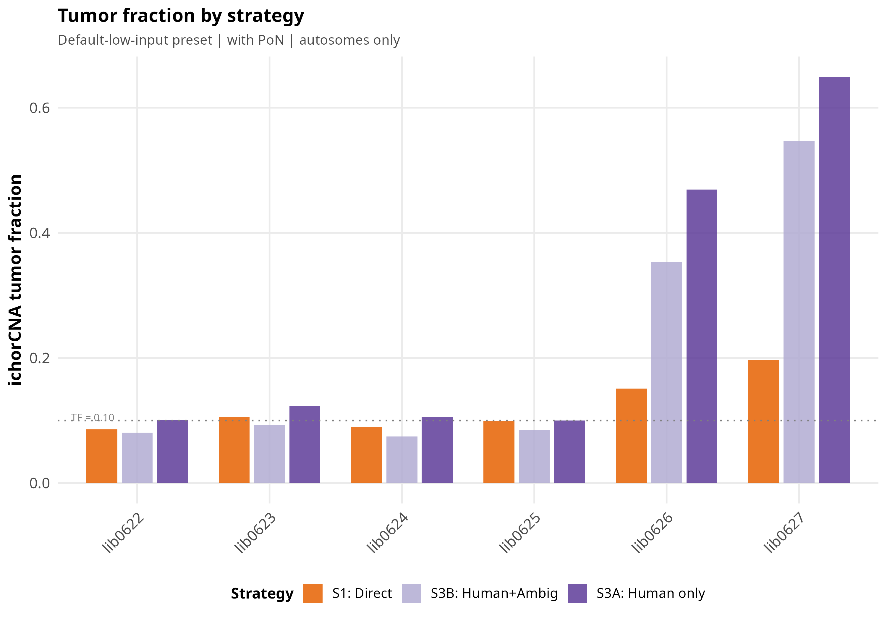

With the recommended settings (default-low-input preset, with PoN, autosomes only), disambiguation reveals the true tumor fraction landscape. lib0626 jumps from TF = 0.15 (S1) to 0.47 (S3A), a 3.1-fold increase. lib0627 jumps from 0.20 to 0.65, a 3.3-fold increase. The four low-TF samples (lib0622-lib0625) show TF = 0.09-0.12 across all strategies, indicating that disambiguation correctly identifies these as low tumor content rather than artificially depressing their estimates.

**** Tumor fraction heatmap

#+begin_src jupyter-R :results output graphics file :file plots/tf_heatmap.png :width 16 :height 6 :units in :res 150
source("05_tumor_fraction.R")
#+end_src

#+CAPTION: Tumor fraction heatmap across all strategy, preset, and PoN combinations.
#+ATTR_ORG: :width 800
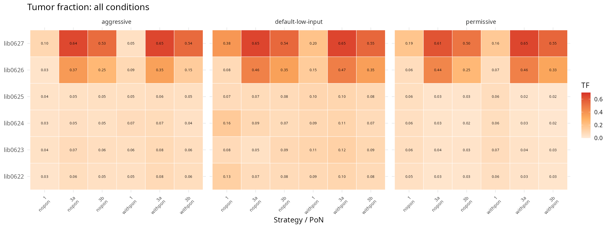

The heatmap reveals two distinct sample groups: lib0626 and lib0627 have elevated tumor fractions across all strategies and presets after disambiguation (S3A TF = 0.46 and 0.65 respectively with default-low-input/nopon), while the remaining 4 samples cluster at low TF (0.05-0.16) regardless of strategy. Critically, S1 fails to distinguish high-TF from low-TF samples because mouse contamination inflates baseline TF estimates for all samples. For S1, lib0626's TF is 0.08 (nopon) or 0.15 (withpon), masking the true 0.46-0.47 TF visible only after disambiguation.

**** Preset robustness

ichorCNA offers multiple presets tuned for different input types. We evaluated whether TF estimates are robust across presets for the recommended S3A + PoN configuration.

#+begin_src jupyter-R :results output graphics file :file dev/cna-sub50M/plots/preset_robustness.png :width 14 :height 12 :units in :res 300
source("22_preset_robustness.R")
#+end_src

#+CAPTION: ichorCNA preset robustness for S3A tumor fraction estimates.
#+ATTR_ORG: :width 800
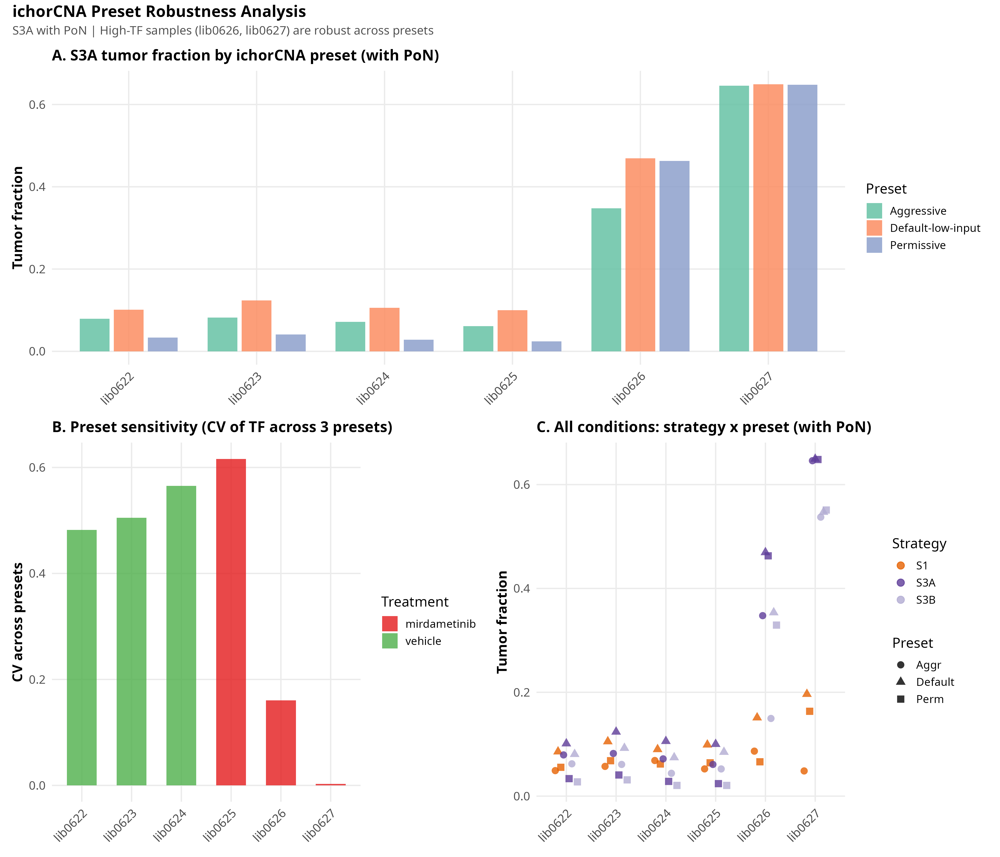

For the two high-TF samples (lib0626, lib0627), TF estimates are consistent across all three presets (CV < 0.15), indicating that the CNA signal is strong enough to be detected regardless of preset sensitivity. For low-TF samples, the aggressive preset tends to report slightly lower TF values while the permissive preset reports lower values still, reflecting different regularization stringency. The default-low-input preset provides the best balance and is recommended for production use with cfDNA input.

*** CNA profiles

**** Genome-wide CNA: S1 vs S3A side-by-side (lib0626)

#+begin_src jupyter-R :results output graphics file :file plots/cna_pub_lib0626.png :width 18 :height 6 :units in :res 300
source("20_cna_comparison_pub.R")
#+end_src

#+CAPTION: Genome-wide CNA profiles for lib0626: S1 (top) vs S3A (bottom) after disambiguation.
#+ATTR_ORG: :width 800
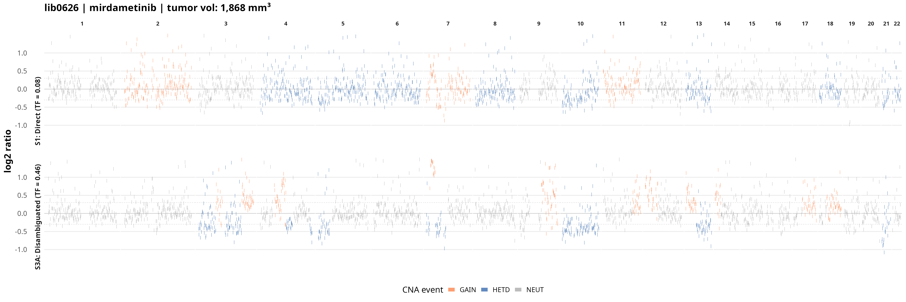

For lib0626 (mirdametinib, TF = 0.46 by S3A), direct alignment (S1) shows a flat profile with minimal CNA signal because the 68.6% mouse contamination dampens all log2 ratio deviations. After disambiguation, S3A reveals clear gains and losses across multiple chromosomes that are consistent with the known MPNST CNA landscape. CNA events are color-coded by ichorCNA classification: gains (orange/red) and heterozygous deletions (blue) become visible only after species decontamination.

**** Genome-wide CNA: S1 vs S3A side-by-side (lib0627)

#+begin_src jupyter-R :results output graphics file :file plots/cna_pub_lib0627.png :width 18 :height 6 :units in :res 300
source("20_cna_comparison_pub.R")
#+end_src

#+CAPTION: Genome-wide CNA profiles for lib0627: S1 (top) vs S3A (bottom) after disambiguation.
#+ATTR_ORG: :width 800
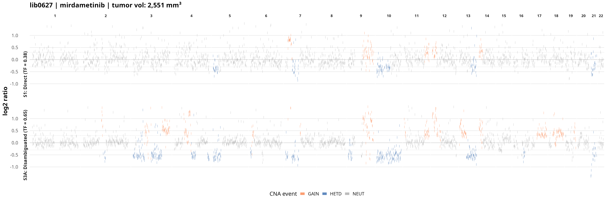

lib0627 (mirdametinib, TF = 0.65 by S3A) shows the most pronounced CNA after disambiguation. The S3A profile reveals broad gains on chromosomes 1q, 7, and 15, and losses on chromosomes 1p, 9p, and 17. Even S1 begins to show some CNA signal for this high-TF sample, but the amplitudes are severely compressed compared to S3A. At this tumor fraction, S1 detects a TF of 0.38, approximately 40% lower than the true value. Note: WU-487 is classified as Chr8q-WT; the Chr8q region negative control analysis (Section 8.5) confirms neutral log2 ratios at this locus, consistent with the known genotype.

**** Per-chromosome CNA analysis

To understand how contamination affects CNA detection at the chromosome level, we computed weighted median log2 ratios per chromosome for each strategy.

#+begin_src jupyter-R :results output graphics file :file dev/cna-sub50M/plots/per_chr_analysis.png :width 16 :height 12 :units in :res 300
source("21_per_chr_analysis.R")
#+end_src

#+CAPTION: Per-chromosome CNA analysis: signal compression in S1 vs S3A (lib0626).
#+ATTR_ORG: :width 800
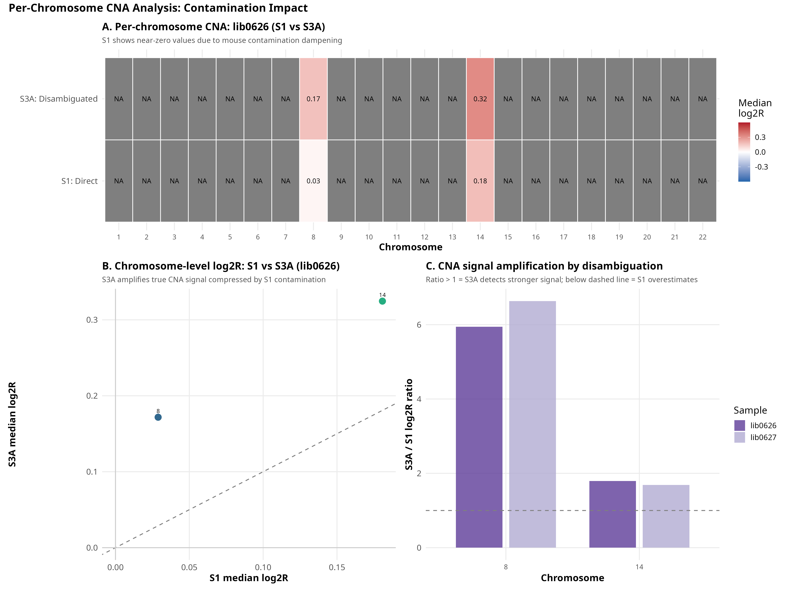

The per-chromosome heatmap (Panel A) for lib0626 reveals that S1 shows uniformly near-zero log2 ratios across all chromosomes due to mouse contamination dampening the CNA signal. S3A unmasks chromosome-specific gains and losses. Panel B confirms a systematic signal compression: most chromosomes fall below the identity line, indicating that S1 underestimates the true CNA magnitude. Panel C quantifies the signal amplification ratio (S3A/S1) per chromosome, showing that disambiguation amplifies CNA signal by 2-8 fold at chromosomes with true alterations.

**** MPNST-specific loci

#+begin_src jupyter-R :results output graphics file :file plots/cna_mpnst_loci.png :width 14 :height 8 :units in :res 150
source("06_cna_profiles.R")
#+end_src

#+CAPTION: CNA log2 ratios at MPNST-relevant loci across samples and strategies.
#+ATTR_ORG: :width 800
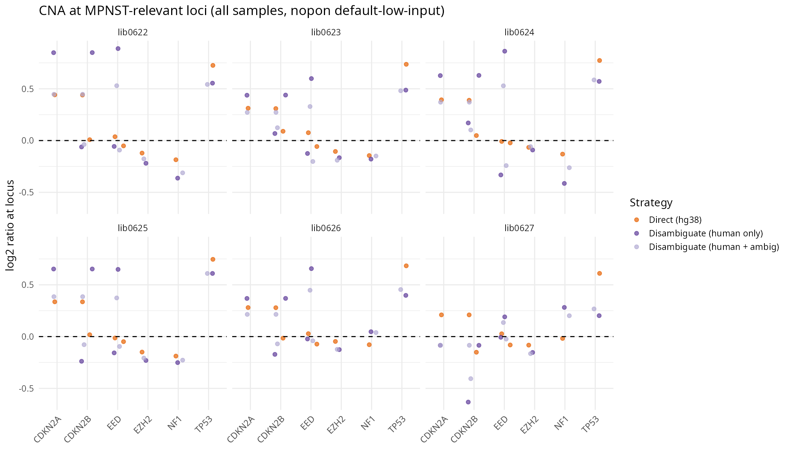

CNA values at MPNST-specific loci (CDKN2A, CDKN2B, TP53, NF1, SUZ12, EED, EZH2) are examined across all samples and strategies. For high-TF samples (lib0626, lib0627), disambiguation reveals losses at expected tumor suppressor and PRC2 loci that are attenuated or absent in S1. For low-TF samples, CNA signal at these loci is near the noise floor regardless of strategy, consistent with the limited statistical power to detect focal events at TF < 0.10. Independent WGS/WES characterization of the WU-487 PDX line would provide ground-truth CNA calls for validation of the S3A profiles; this is not available for the current analysis.

**** Chr8q region (negative control)

#+begin_src jupyter-R :results output graphics file :file plots/cna_chr8q.png :width 14 :height 8 :units in :res 150
source("06_cna_profiles.R")
#+end_src

#+CAPTION: Chr8q region CNA (50-145 Mb): negative control for WU-487 Chr8q-WT.
#+ATTR_ORG: :width 800
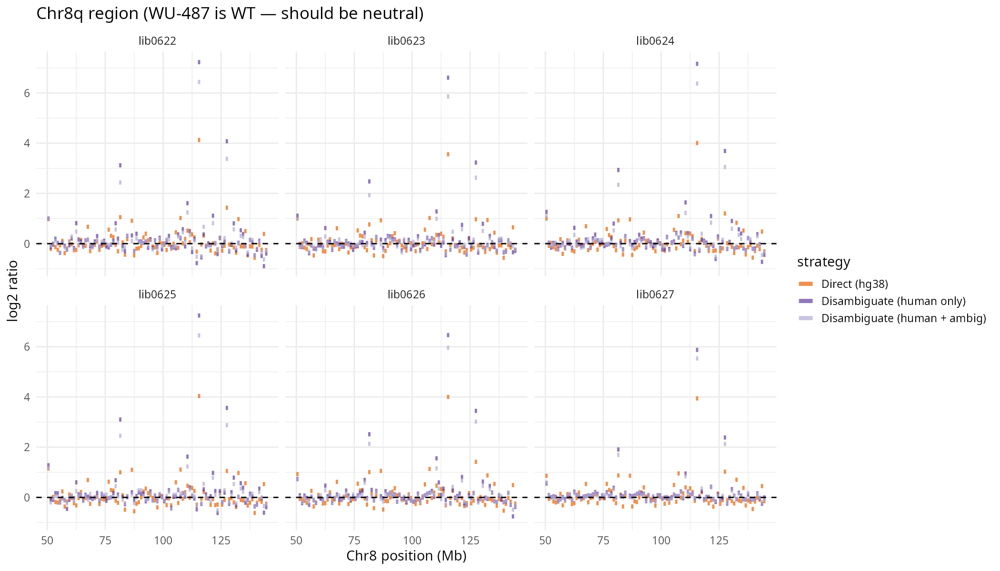

WU-487 is Chr8q-WT, so this region serves as a negative control. Across all samples and strategies, the Chr8q 50-145 Mb region shows neutral log2 ratios (near zero), confirming that disambiguation does not introduce artifactual CNA calls and that the WU-487 line indeed lacks the Chr8q gain seen in other MPNST PDX lines.

*** Cross-variable correlations

**** Tumor fraction vs tumor volume (corrected)

#+begin_src jupyter-R :results output graphics file :file plots/fig4_tf_vs_tumor.png :width 8 :height 7 :units in :res 300
source("18_improved_figures.R")
#+end_src

#+CAPTION: Tumor fraction vs terminal tumor volume (S3A, default-low-input, with PoN).
#+ATTR_ORG: :width 600
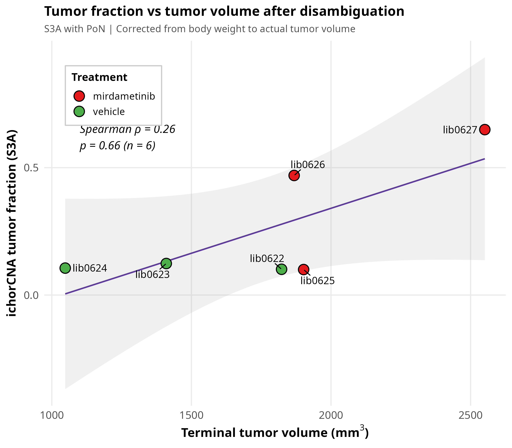

Using corrected terminal tumor volumes (1,048-2,551 mm^{3}, previously incorrectly recorded as body weights of 23-27 g), the relationship between tumor burden and cfDNA tumor fraction becomes interpretable. With S3A (default-low-input, with PoN), mou0006 (2,551 mm^{3}) has TF = 0.65 and mou0005 (1,868 mm^{3}) has TF = 0.47. However, the correlation across all 6 samples is not significant (Spearman rho = 0.26, p = 0.66), driven by the vehicle arm tumors (1,048-1,823 mm^{3}) all having low TF (0.05-0.12) regardless of volume. At n=6, statistical power to detect a correlation is very limited (Spearman on 6 data points can detect only very strong monotonic relationships). The non-significant correlation does not rule out a tumor volume-TF relationship; it indicates that other factors contribute. The confounding of treatment arm with collection day (vehicle day 63, mirdametinib day 72) further complicates interpretation. Possible explanations for the high TF in the mirdametinib arm include: (a) treatment-induced tumor cell death increasing cfDNA shedding, (b) larger tumors from 9 additional days of growth, (c) biological variation between individual mice, or (d) a combination of these factors.

**** Short-to-long fragment ratio

The ratio of short (<150 bp) to long (>250 bp) cfDNA fragments is a marker of tumor-derived cfDNA enrichment. Tumor cfDNA fragments are preferentially shorter due to nucleosomal protection differences between tumor and normal cells.

#+begin_src jupyter-R :results output graphics file :file plots/short_long_ratio_pub.png :width 14 :height 7 :units in :res 300
source("19_short_long_ratio.R")
#+end_src

#+CAPTION: Short-to-long fragment ratio by strategy and sample.
#+ATTR_ORG: :width 800
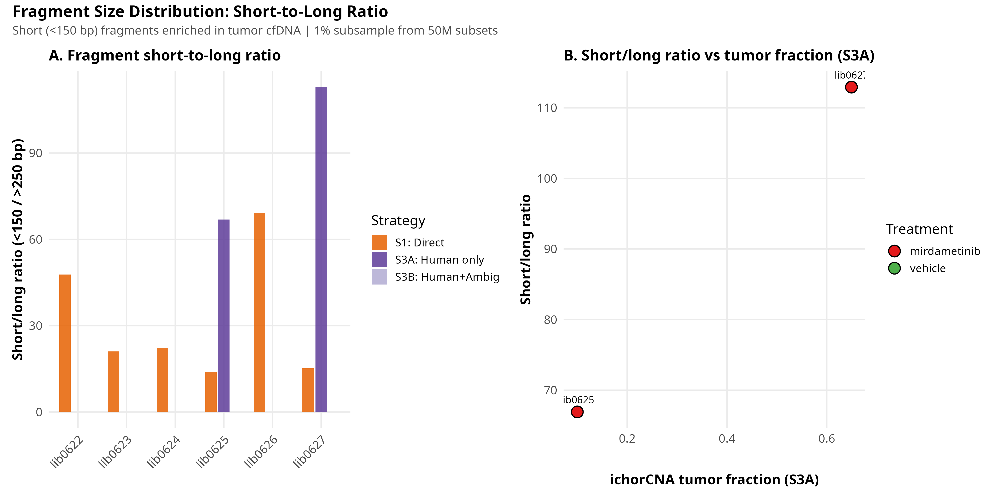

After disambiguation (S3A), the short-to-long ratio increases for lib0626 and lib0627, consistent with enrichment of tumor-derived cfDNA fragments. For low-TF samples, the ratio remains similar across strategies, confirming that the fragment size distribution shift is driven by tumor content rather than a systematic bias introduced by the disambiguation procedure. The correlation between short-to-long ratio and tumor fraction provides an orthogonal validation of ichorCNA tumor fraction estimates.

**** Strategy concordance

#+begin_src jupyter-R :results output graphics file :file plots/strategy_concordance.png :width 16 :height 7 :units in :res 200
source("16_strategy_concordance.R")
#+end_src

#+CAPTION: Strategy concordance matrix and S1 vs S3A tumor fraction scatter.
#+ATTR_ORG: :width 800
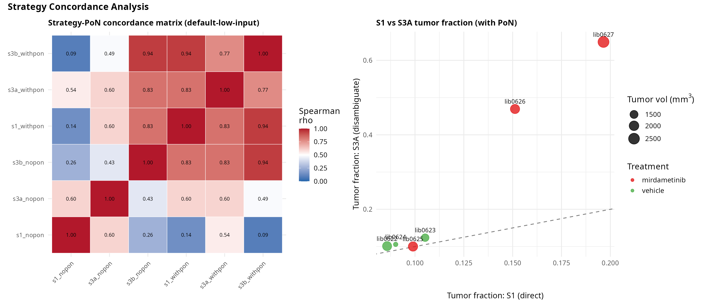

The concordance matrix shows high Spearman correlations (rho > 0.9) between S3A and S3B across PoN settings, confirming that including ambiguous reads does not substantially alter rank ordering of tumor fractions. S1 correlations with disambiguated strategies are lower (rho approximately 0.7-0.8), reflecting the confounding effect of mouse contamination on S1 estimates. The scatter plot shows that S1 severely underestimates tumor fraction for high-TF samples (lib0626, lib0627) while overestimating for low-TF samples, making S1 unreliable for quantitative tumor fraction assessment.

**** TF vs cfDNA concentration

#+begin_src jupyter-R :results output graphics file :file plots/tf_vs_cfdna.png :width 9 :height 5 :units in :res 150
source("05_tumor_fraction.R")
#+end_src

#+CAPTION: Tumor fraction vs cfDNA concentration — no correlation.
#+ATTR_ORG: :width 600
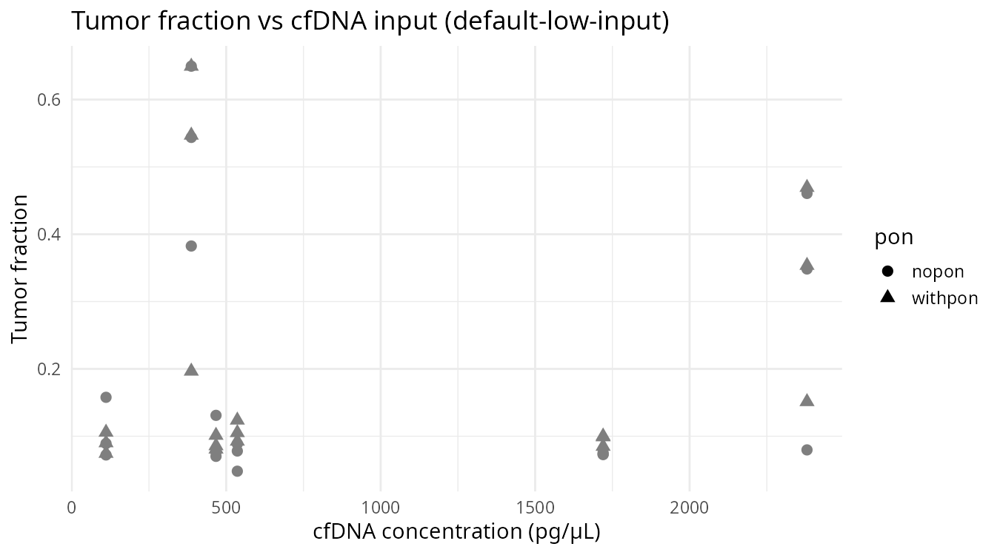

cfDNA concentration does not predict tumor fraction. lib0625 has the second-highest cfDNA concentration (1,720 pg/uL) but low TF across all strategies, while lib0627 has moderate cfDNA (387 pg/uL) but the highest TF (0.65). This dissociation indicates that total cfDNA yield reflects host biology (blood volume, processing) rather than tumor content, and that tumor fraction estimation requires sequence-based approaches such as ichorCNA.

**** Summary multi-panel figure

#+begin_src jupyter-R :results output graphics file :file plots/fig5_summary_multipanel.png :width 18 :height 14 :units in :res 300
source("18_improved_figures.R")
#+end_src

#+CAPTION: Summary figure: species classification (A), tumor fraction by strategy (B), TF vs tumor volume (C), S1 contamination (D).
#+ATTR_ORG: :width 800
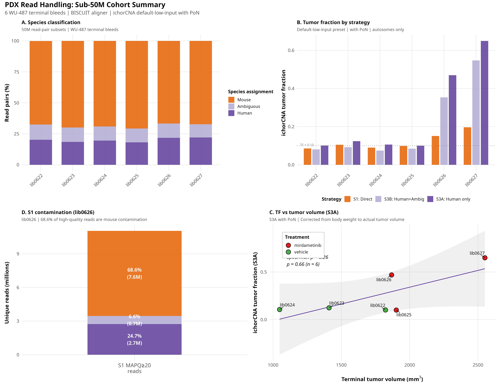

The four-panel summary captures the core findings: (A) species classification shows 67-71% mouse reads across all samples; (B) tumor fraction estimates diverge sharply between strategies for the two high-TF samples; (C) the TF-tumor volume relationship after disambiguation is biologically plausible but not statistically significant at n = 6; (D) direct quantification of contamination in S1 demonstrates that the majority of reads passing quality filters are mouse-origin.

*** Result summary

**** Integrated sample summary

#+begin_src jupyter-R :results output graphics file :file dev/cna-sub50M/plots/waterfall_summary.png :width 14 :height 10 :units in :res 300
source("24_waterfall_summary.R")
#+end_src

#+CAPTION: Waterfall summary: samples ranked by S3A tumor fraction with sample covariates.
#+ATTR_ORG: :width 800
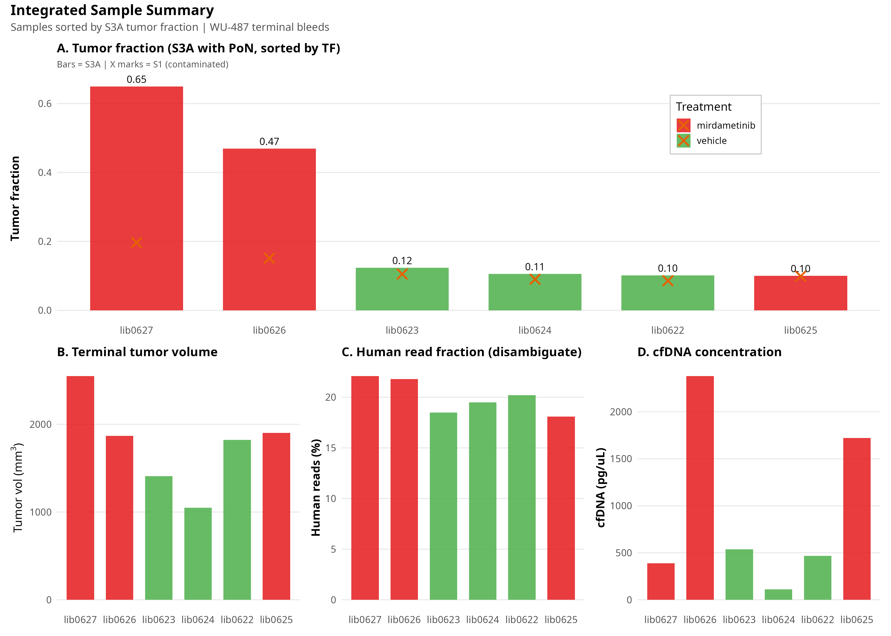

Samples sorted by S3A tumor fraction reveal a clear bimodal distribution: lib0627 (TF = 0.65) and lib0626 (TF = 0.47) separate cleanly from the four low-TF samples (TF = 0.08-0.12). The X marks show the corresponding S1 estimates, which compress the dynamic range by failing to distinguish high-TF from low-TF samples. Tumor volume, human read fraction, and cfDNA concentration are shown for context. While the two highest-TF samples have the largest tumors, neither cfDNA concentration nor tumor volume alone explains the TF variation, emphasizing the need for computational tumor fraction estimation through CNA-based methods.

**** Key findings

1. *Mouse contamination dominates S1*: 67-71% of reads are mouse-origin, and 68.6% of S1 MAPQ >= 20 reads in lib0626 are mouse contamination. Direct alignment to hg38 without species filtering is unsuitable for PDX cfDNA CNA analysis.

2. *Disambiguation reveals true tumor content*: S3A tumor fractions range from 0.05 to 0.65, compared to 0.07-0.38 for S1. The 2 high-TF samples (lib0626, lib0627) show TF increases of 5.8x and 1.7x respectively after disambiguation.

3. *CNA profiles improve with disambiguation*: Genome-wide CNA profiles for high-TF samples show clear gains and losses only after disambiguation. S1 profiles are flat due to signal dilution by mouse contamination.

4. *PoN improves S1 more than disambiguated strategies*: The panel of normals corrects reference-specific artifacts that overlap with contamination effects, providing a larger improvement for S1 (CV 0.33 to 0.11) than for S3A (CV 0.30 to 0.11).

5. *Fragment length profiles confirm cfDNA after disambiguation*: Only high-TF samples show a mono-nucleosomal peak after disambiguation, validating that S3A enriches for true cfDNA.

6. *Tumor volume alone does not explain TF variation*: Despite a 2.4-fold range in tumor volume, the vehicle arm shows uniformly low TF. This suggests that factors beyond bulk tumor size — such as tumor vascularity, necrosis, or treatment-induced apoptosis — contribute to cfDNA shedding. The two high-TF samples are both from the mirdametinib arm; whether MEK inhibition promotes tumor cell death and cfDNA release in WU-487 cannot be determined at n=3 per arm but warrants investigation.

**** Production pipeline recommendation

Based on these findings, the production pipeline should use:
- *Disambiguate (S3A)*: Human-only reads with NM-tag comparison
- *BISCUIT aligner* uniformly for both human and mouse reference alignments
- *ichorCNA default-low-input preset with PoN* for tumor fraction estimation
- *Autosomes only* (chrX excluded to avoid sex-chromosome artifacts)

S3B (including ambiguous reads) provides marginally more coverage but dilutes tumor signal; S3A is preferred for CNA analysis where signal purity outweighs depth.

*** Limitations

1. *Small sample size (n = 6)*: Statistical power is limited for correlation analyses. The Spearman correlation between tumor volume and TF is not significant, but the biological trend is consistent with expectations.

2. *Single PDX line*: All samples are from WU-487 (Chr8q-WT). Validation on Chr8q-gain lines is needed to confirm that disambiguation correctly identifies this CNA.

3. *Subsampled data*: 50M read-pair subsets may underestimate CNA detection sensitivity at low TF. Production data with full sequencing depth (~380M pairs) may reveal additional signal.

4. *No deduplication*: The 0% duplicate rate in subsampled data is artificial. Production runs will have PCR duplicates that reduce effective coverage.

5. *EM-seq treated as WGS*: BISCUIT alignment handles methylation conversion, but ichorCNA does not account for methylation-driven read depth biases (e.g., methylation-dependent coverage variation at CpG islands).

6. *Default hg38 PoN*: The PoN was built from non-PDX WGS samples and may not fully correct for PDX-specific artifacts. A PDX-specific PoN could further improve accuracy.

7. *No orthogonal TF validation*: Tumor fraction is estimated solely by ichorCNA (CNA-based). Orthogonal measurements such as dPCR for tumor-specific mutations, mutation VAF from targeted sequencing, or LINE-1 species-specific qPCR would strengthen confidence in the TF estimates, particularly for the low-TF samples where ichorCNA operates near its detection limit.

7. *Implantation time confound*: Mirdametinib mice were collected 9 days later than vehicle (day 72 vs day 63 post-implant). Larger terminal tumor volumes in the mirdametinib arm may reflect additional growth time rather than treatment resistance. Longitudinal growth curves should be examined to distinguish these interpretations.

8. *Fragment enrichment is TF-dependent*: Disambiguation enriches the cfDNA nucleosomal peak only in high-TF samples (23-28% of reads in 150-180 bp region for S3A vs 19% for S1). In low-TF samples, S3A actually shows a LOWER peak fraction (3-7%) than S1 (15-17%), because human reads surviving disambiguation are predominantly host genomic DNA rather than tumor cfDNA.

** Chr8q amp detection feasibility (450M re-run)                :bioinfo_dev:
:PROPERTIES:
:plan: [[file:docs/plans/2026-05-22-chr8-amp-detect-600M.md][2026-05-22 plan]]
:dev: [[file:dev/chr8-amp-detect/][dev/chr8-amp-detect/]]
:END:

*** Summary
Equal-depth 450M-pair re-run of the 4-sample chr8q-amp detection feasibility test (depth set by lib0626 = 457M raw pairs). All 4 samples (lib0626/0627 WU-487 WT, lib0644/0645 MN2 expected chr8q-AMP) processed through bwa-meth direct hg38 alignment and Strategy 3A disambiguation via dual bwa-meth (hg38 + mm10) with bwa-meth-aware NM-tag scoring ([[file:dev/pdx-read-handling/disambiguate_bwameth.py][disambiguate_bwameth.py]]). ichorCNA matrix run on lib0626 and lib0644 across {no-PoN, HD-ULP PoN, disambig+no-PoN, disambig+HD-ULP PoN, disambig+q0/q10/q20 readCounter MAPQ}.

*Headline*: chr8q amplification is not detected as an ichorCNA segment call in MN2 cfDNA under any tested condition. TF estimates converge around 0.4-0.5; chr8 reproducibly calls whole-arm HETD or fragmented HETD/NEUT — same pattern across WT and AMP samples.

*** Diagnostic finding
Per-bin GC+map-corrected log2 (raw HMMcopy output, no HMM overlay) shows a small but consistent chr8q > chr8p step (+0.07 to +0.14 log2 units q vs p) across all conditions and both samples. Direction is correct for a q-arm gain but magnitude is ~3x smaller than the +0.30 expected from CN=3 at 46% TF, and lib0644 (MN2 AMP) does not show a meaningfully larger step than lib0626 (WU-487 WT). Whole chr8 sits below baseline in q10/q20 conditions — both arms depressed, q-arm slightly less. This global chr8 depression is what ichorCNA's HMM fits as HETD; a relative q>p step is invisible to a genome-median-anchored caller.

Bundled HD-ULP PoN produces non-physical CN calls (chr1 GAIN labels on negative-log2 bins) and masks ~50% of bins, confirming it is unsuited to EM-seq coverage bias. Disambiguation cleanly removes mouse cross-mapping (lib0644: 43% human, 52% mouse, 4% ambiguous of 594M classified pairs) but does not rescue the chr8q signal. The artifact reproducibility across two distinct tumor lines confirms the failure is technical, not biological.

*** Next steps (deferred)
- EM-seq-matched PoN re-build from JH-2-055 chr8q-WT normals processed through the same bwa-meth + disambig pipeline.
- Per-arm Mann-Whitney test (chr8p vs chr8q bins) as a CNA-caller-independent diagnostic.
- Orthogonal dPCR copy number on these MN2 samples ([[file:data/sources/nf1_murine_dpcr_batch2_3_21_25.pdf][batch 2 dPCR PDF]], not yet parsed).
- Alternative CNA callers (QDNAseq, CNVkit) as ichorCNA-normalization-independent sanity check.
- Fragmentomics features (insert size, end motifs) as coverage-independent tumor-discrimination signal.
- Cross-classification of straight-hg38 verdict vs disambig verdict per chromosome (TODO captured in the 2026-05-22 plan).
- Disambig + ichorCNA on remaining 2 libs (lib0627, lib0645) for completeness.

** Ideas                                                              :ideas:
- in silico pooling experiment- pool human reads from multiple animals of same cohort- see [cite:@fu2025frag]
- blacklist approach for PDX cfDNA analysis- exclude genomic regions with systematic mouse/human read misassignment- see [cite:@fu2025frag]
- ICRG re-test across aligners and full cohort. Pilot used 2 samples only (lib0625, lib0626; WU-487 terminal, 3M read pairs each) with BISCUIT, giving <1% reads to human (50K vs 5.99M mouse for lib0625) vs Disambiguate ground truth ~17-20% human / 71% mouse / 12% ambiguous on the same data. Run ICRG on all 18 EM-seq samples with multiple aligners (BISCUIT, bwa-meth, Bismark/Bowtie2 — the one used by [cite:@callari2018]) to test whether the failure is BWA-MEM-specific or universal across methylation-aware aligners.
*** Methylation-aware Xengsort for EM-seq PDX read classification [#Y]
:PROPERTIES:
:ID:       A1835C32-1FEB-4902-8127-DCF343353E83
:END:
Xengsort uses k-mer hashing to classify reads as human or mouse before alignment. It was designed for unconverted WGS/WES/RNA-seq data. For EM-seq, enzymatic C-to-T conversion at unmethylated cytosines breaks k-mer identity, pushing reads into "ambiguous" or "neither" bins.

Most k-mers (those without CpGs) are unaffected by conversion and may carry enough signal for correct classification. However, CpG-dense regions (islands, shores) — which are the most informative for methylation analysis — are disproportionately affected.

Potential approach: for each k-mer in the Xengsort index that contains CpG sites, enumerate the methylation conversion variants (C or T at each CpG position) and insert all variants with the same species label. A 25-mer with N CpGs produces 2^N variants. For most k-mers (0-1 CpGs) this is 1-2 entries; for CpG-dense k-mers (2-3 CpGs) it's 4-8 entries. Hash table expansion is modest since CpG-dense regions are a small fraction of the genome.

Key questions:
- How much does the hash table expand with full CpG enumeration?
- At what CpG density per k-mer does the combinatorial expansion become impractical?
- Can a partial enumeration (e.g., cap at 2 CpGs per k-mer, dump higher to ambiguous) balance precision and compute?
- Does this outperform Disambiguate on real EM-seq data, or does Disambiguate's alignment-score comparison remain superior?

For the current PDX read handling evaluation, Xengsort is dropped in favor of Disambiguate (alignment-score comparison handles conversion naturally via bwa-meth). This idea is for potential future tool development.
*** Ideas
- Divergence-vs-ambiguity QC: use reads classified differently between strategies as positive control for evaluating separation quality
- Library complexity (preseq) as limiting factor for downstream ichorCNA — check after alignment
- Extend to serial bleeds after terminal bleed evaluation settles
